# BasicFamily Tutorial

This tutorial explains how to use Eclipse Sirius to create graphical editors for visually describing a family.

**##①使用EcoreTools创建BasicFamily元模型**（右键创建的项目设置运行配置）

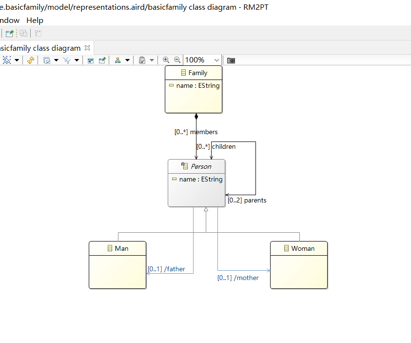

②**运行建立好的**BasicFamily元模型，创建实例验证元模型

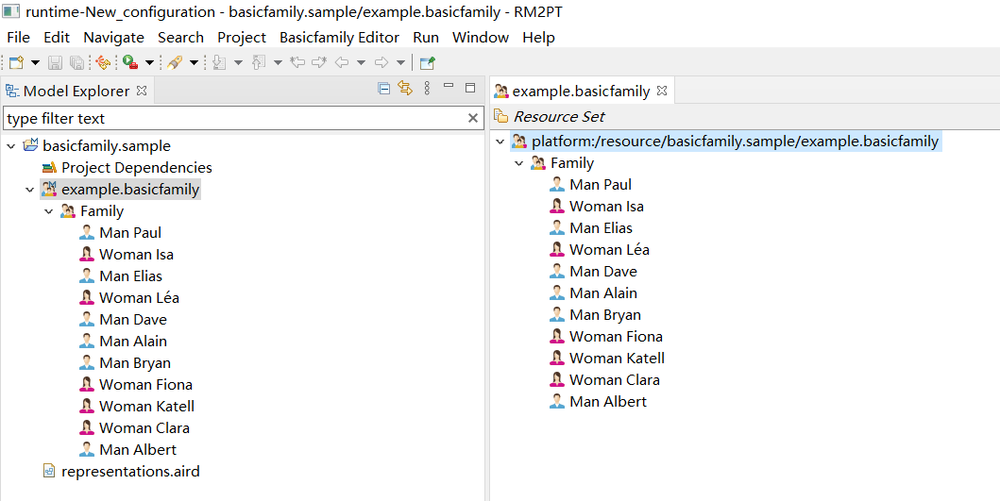

***tips***上图的图标改变是在建立BasicFamily时改变的，操作如下

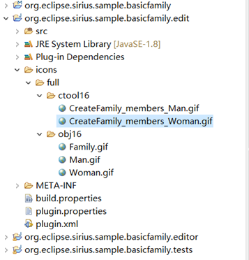

③创建 Viewpoint Specification 项目

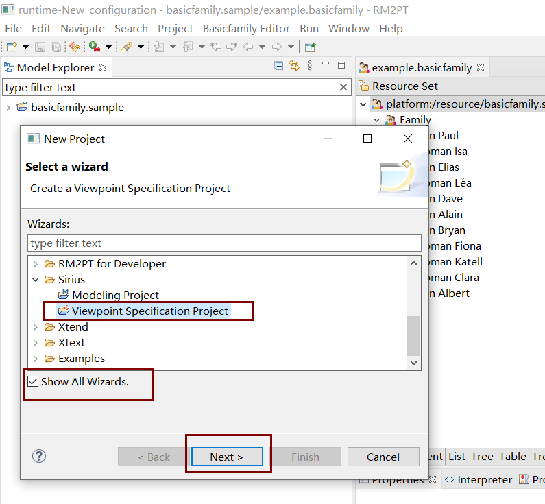

④双击viewpoint设置视点属性，如下

⑤打开项目的*MANIFEST.MF*文件，然后在“*必需插件*”列表添加定义元模型的插件

⑥在视点中添加图，并且关联定义此图使用的类型的*元模型*（定义图的属性） 如下

⑦在图中添加节点并设置属性

⑧为节点设置样式

⑨测试自己定义的图

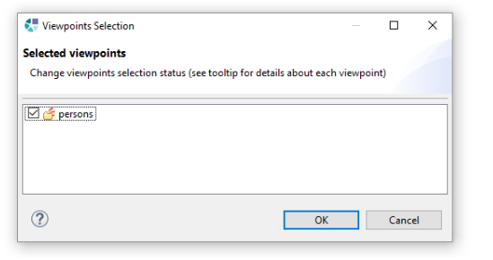

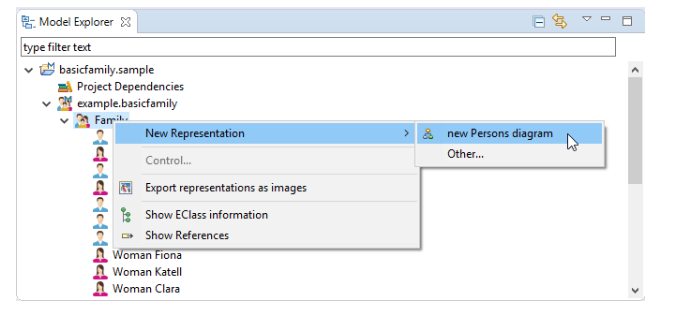

⑩改善节点样式

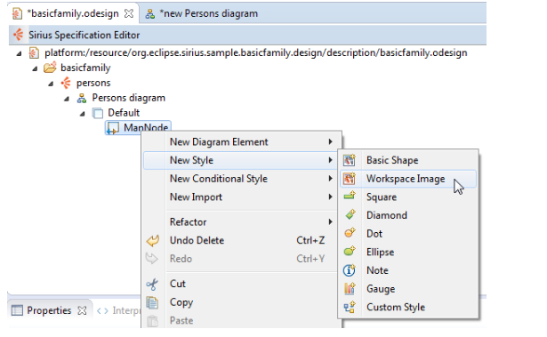

十一、添加基于关系的边

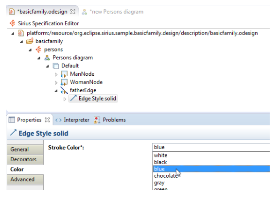

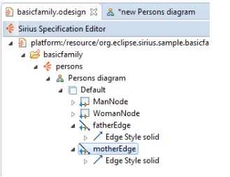

十二、在调色板中添加可以创建元素的工具

十三、定义由“创建节点”工具执行的操作

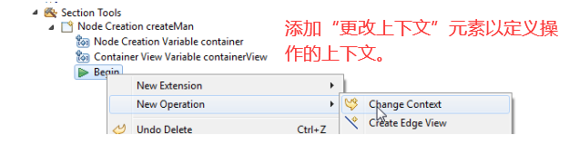

效果如下

十四、边线创建工具

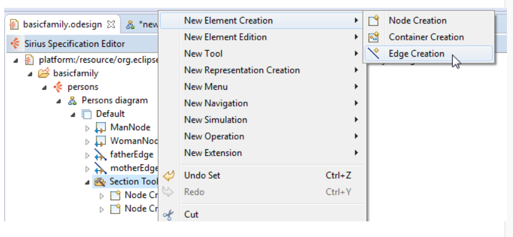

然后定义每次用户单击该工具时将由该工具执行的操作。这些操作可以使用Sirius自动设置的四个变量：

- **source**：用户单击的第一个对象（他将创建的关系的源）
- **target**：用户单击的第二个对象（他将创建的关系的目标）
- **sourceView**：表示源的图形对象
- **targetView**：表示目标的图形对象

为了防止用户创建一个人与人或其子女之一的*父亲*关系，您可以添加前提条件表达式

此表达式使用两个新变量：

- **preSource**：用户首先单击的对象
- **preTarget**：光标下的对象

十五、重新连接边线工具

该工具带有六个变量：

- **源**：当前附加到移动端的对象

- **target**：将要附加到移动端的对象

- **sourceView**：表示源的图形对象

- **targetView**：表示目标的图形对象

- **element**：连接到另一端的对象

- **elementView**：表示元素的图形对象

  

十六、删除元素工具

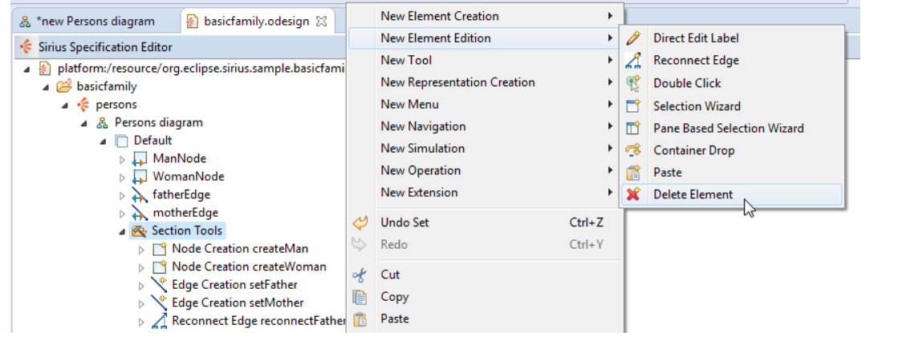

十七、直接编辑标签工具

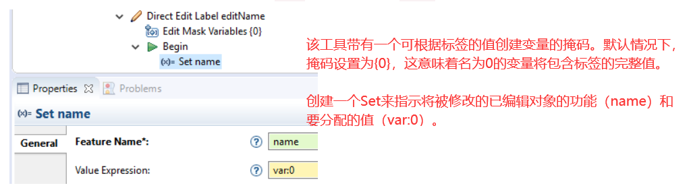

效果如下

十八、风格定制

十九、创建两个图层

创建第二个*图层，* `Women`然后拖放与“*女人”*类型相关的所有元素。效果如下

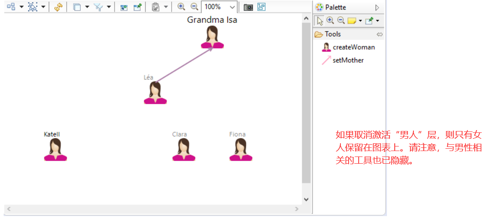

二十、筛选器

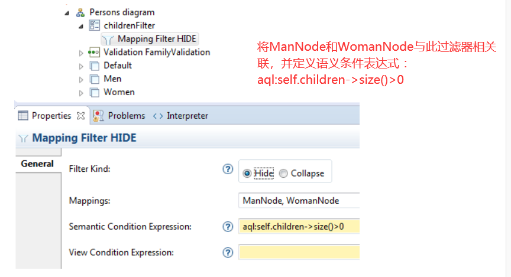

二十一、验证规则

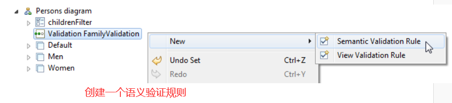

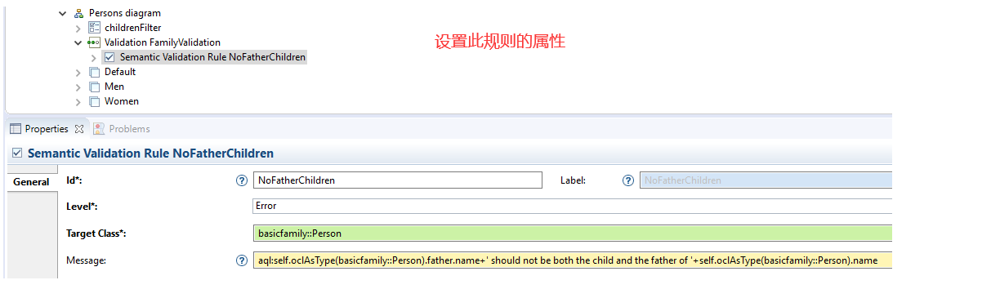

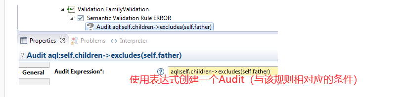

验证效果如下

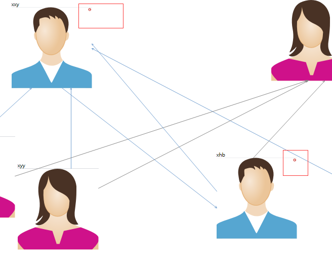

二十二、快速修复（可以向用户提供*修复程序*，以自动解决问题）

例如，上个问题，我们可以建议取消两个*父亲*关系之一。

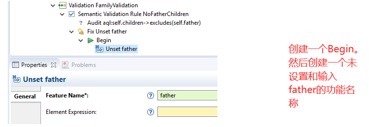

效果如下

二十三、以对象为中心的图

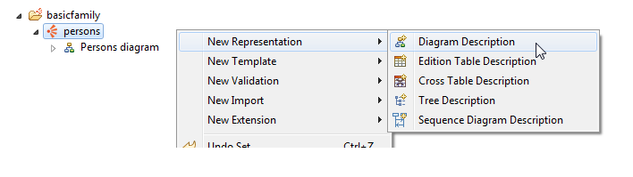

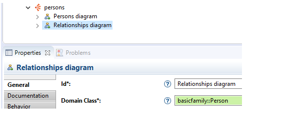

二十四、容器

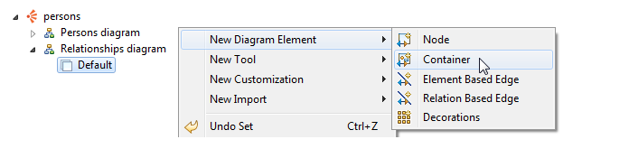

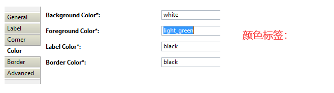

二十五、子节点

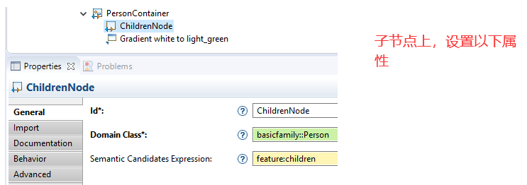

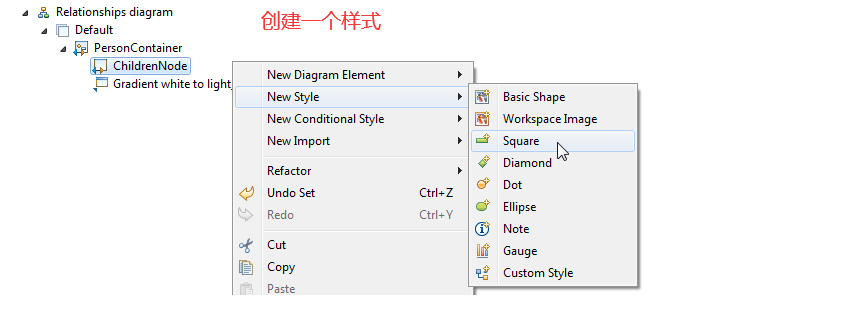

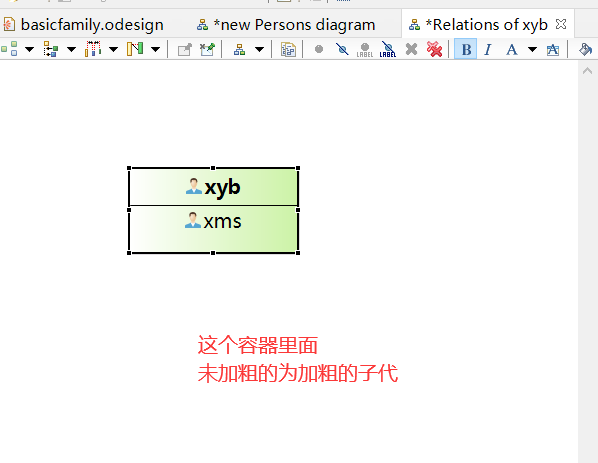

二十六、边界节点

二十七、容器之间的边线

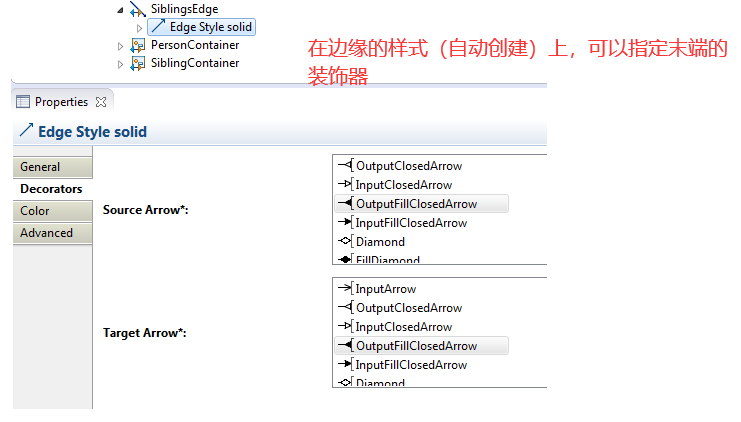

二十八、Double Click

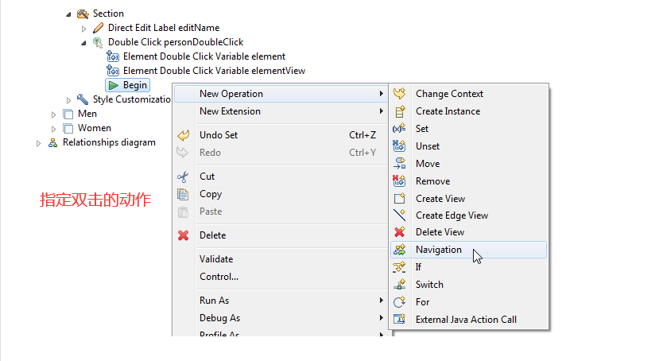

效果如下

二十九、表

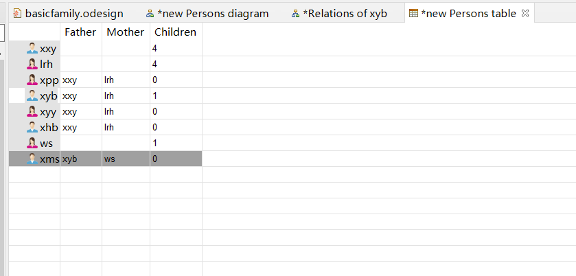
