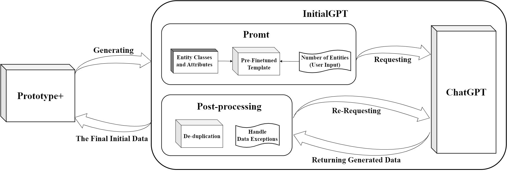
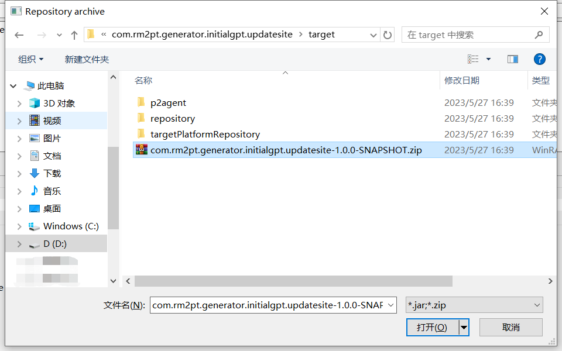
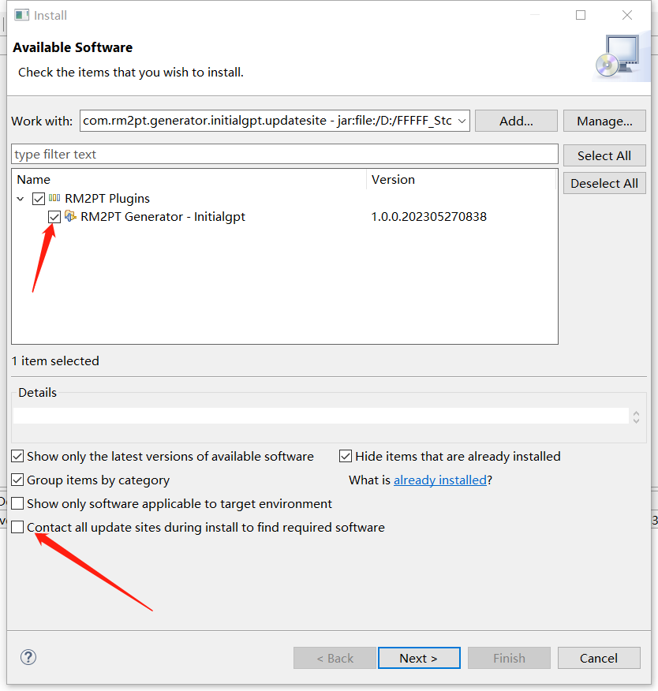
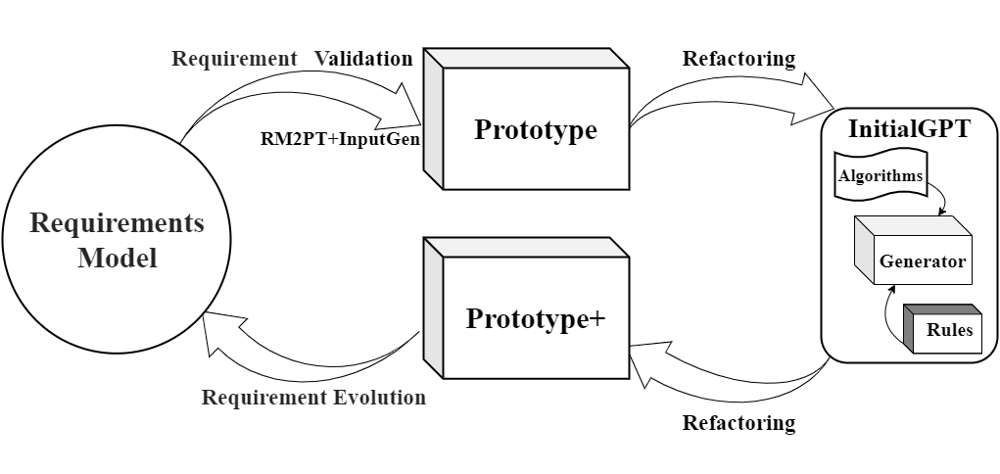
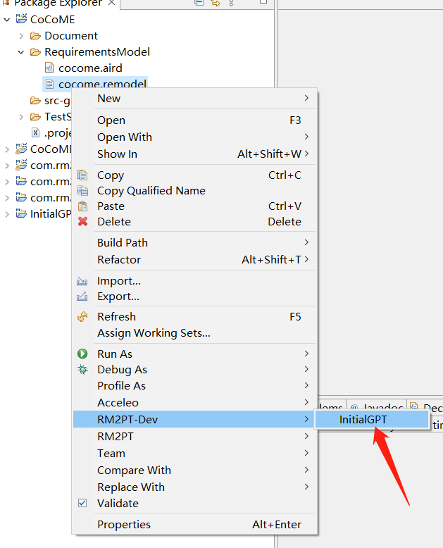
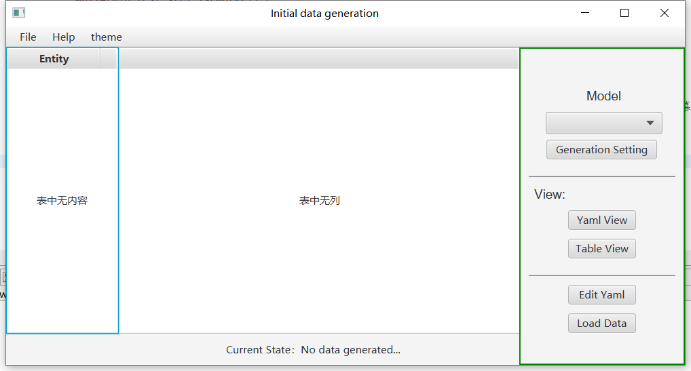
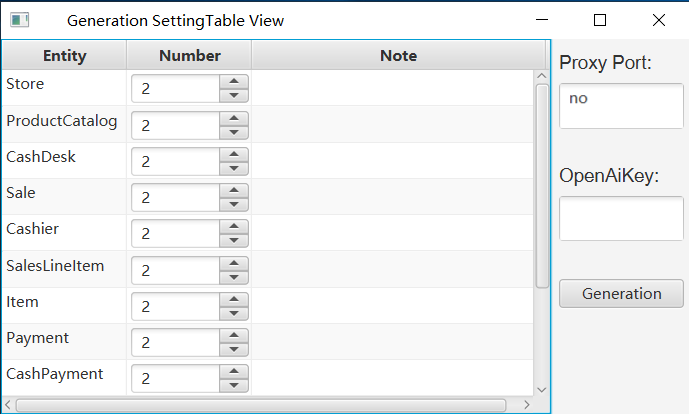
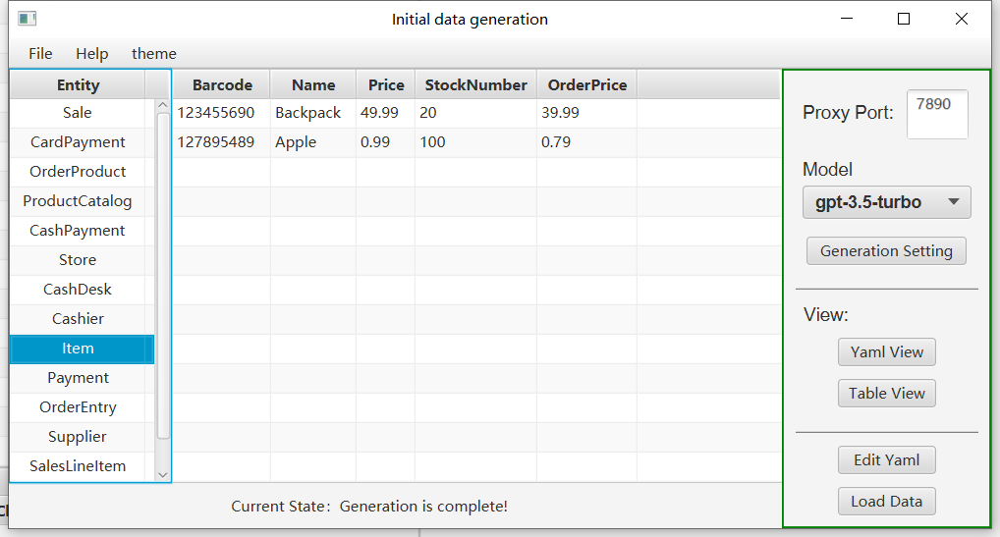

## Introduction

**InitialGPT** is a ChatGPT-enhanced tool for automaticlly generating initialization data of prototype to support rapid requirements validation. The **benefits** of InitialGPT are as follows:

1. **Automatic Generating Initialization Data of Prototype**. InitialGPT can automatically refactor the prototype generated by RM2PT to support generating the initial data of prototypes.

2. **Automatic Data Prompts Generation for ChatGPT**. We propose a method for automatically generating prompts for large language models from requirement models, which can be used to generate initial data for prototypes.

3. **Less time Required for Requirements Validation**. Compared with the original prototype generated from RM2PT and InputGen, the enhanced prototype can automatically generate substantial and reasonable initial data of the prototype, this will boost the validation process.

The video cast its feature is listed as follows (Youtube):
<iframe class="uk-width-1-3@m" width="560" height="315" src="https://www.youtube.com/embed/jj4SLqe5kWI" frameborder="1" allow="accelerometer; autoplay; encrypted-media; gyroscope; picture-in-picture" allowfullscreen>InitialGPT Youtube Video</iframe>

### InitialGPT Installation

#### Prerequest

InitialGPT is an advanced feature of **RM2PT**. We recommend you to use InitialGPT in RM2PT. If you don't have RM2PT, download [here](https://rm2pt.com/downloads/).

### Installation

Click [here](https://github.com/lemon-521/InitialGPT/releases/download/V1.1.0/com.rm2pt.generator.initialgpt.updatesite-1.0.0-SNAPSHOT.zip) to download InitialGPT. Follow the steps below to install.

## InitialGPT Tutorial

### Prerequest

In order to generate the prototype inputs, you need a requirement model, the **RM2PT project**. For creating or importing a RM2PT project，you can see the tutorial [here](https://rm2pt.com/tutorial/user/create_new_project). We recommend importing RM2PT projects from Git, which is avaliable at [CaseStudies](https://github.com/RM2PT/CaseStudies). The tutorial is [here](https://rm2pt.com/tutorial/user/import_rm2pt_project).

### Input of InitialGPT — Requirements Model

The input to InitialGPT is a UML requirements model with OCL constraints. The model includes: a conceptual class diagram, a use case diagram, system sequence diagrams, contracts of and system operations.

- **A conceptual class diagram:** A conceptual class diagram is a concept-relation model, which illustrates abstract and meaningful concepts and their relations in the problem domain, in which the concepts are specified as classes, the relations of the concepts are specified as the associations between the classes, and the properties of the concepts are specified as the attributes of the classes.

- **A use case diagram:** A use case diagram captures domain processes as use cases in terms of interactions between the system and its users. It contains a set of use cases for a system, actors represented a type of users of the system or external systems that the system interacts with, the relations between the actors and these use cases, and relations among use cases.

- **System sequence diagrams:** A system sequence diagram describes a particular domain process of a use case. It contains the actors that interact with the system, the system and the system events that the actors generate, their order, and inter-system events. Compared with the sequence diagram in design models, a system sequence diagram treats all systems as a black box and contains system events across the system boundary between actors and systems without object lifelines and internal interactions between objects.
- **Contracts of system operations:** The contract of a system operation specifies the conditions that the state of the system is assumed to satisfy before the execution of the system operation, called the pre-condition and the conditions that the system state is required to satisfy after the execution (if it terminated), called the post-condition of the system operation. Typically, the pre-condition specifies the properties of the system state that need to be checked when system operation is to be executed, and the postcondition defines the possible changes that the execution of the system operation is to realize.

### 1) Generate a prototype from the requirement model
After you import a requirements model, first, we use the RM2PT to generate a prototype from the requirements model by right click on `cocome.remodel` -> `RM2PT`-> `OO Prototype`-> ` Generate Desktop Prototype`

### 2) Run the InitialGPT tool to refactor and enhance the prototype
after you generate a prototype, we use the InitialGPT to refactor the prototype from the requirements model by right click on `cocome.remodel` -> `RM2PT-dev`-> `InitialGPT`, and update the project.

### 3) The third step is to run the refactored prototype
Run the refactored prototype to validate the requirements by right click on `COCOMEPrototype` -> `pom.xml`-> `run`-> `maven build`
.

### 4) Generate the initial data to validate the requirements.

### The Output of InitialGPT

After automatically refactoring and enhancing the generated prototype by the tool InitialGPT, the enhanced prototype contains two advantages as follows:

- **Automatic initial data generation of prototypes**. The enhanced prototypes can automatically generate prototype initial data for requirement validation via a large language model.

- **Prompting Large Language Models**. A method is proposed to automatically generate prompts for large language models based on the requirement model, aiming to prompt GPT-3 to generate more compliant, reasonable, and effective data that satisfies the requirements.

### For example
 Click on the initial data generation button and in the data generation screen

1. First select the model, currently ChatGPT's gpt-3.5-turbo is used, other large language models will be added later.

2. Click on Generate Settings and then choose whether to use a proxy on the pop-up page. If you do, please delete "no" and fill in your own proxy port.

3. Fill in your openai key.

4. here you can set the number of entities we want to generate for each entity. Also, you can add as many prompts as you want to the note box.

5. After the settings have been made, click on the Generation button and it will be generated automatically. Here you can see the time corresponding to the number of generated entities we have tested.

6. After successful generation, you can view the generated entities in the table view or yaml view, and you can also modify them to better match your requirements.

7. Finally, click on the load data button to import the initial data into the prototype.

8. The generated data will also be saved and can be imported again by clicking the loadfile button.

For more details, please see [CaseStudies](https://github.com/RM2PT/CaseStudies).

