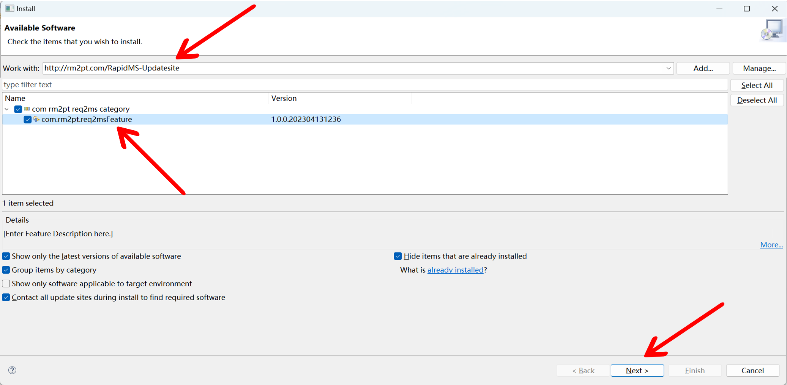
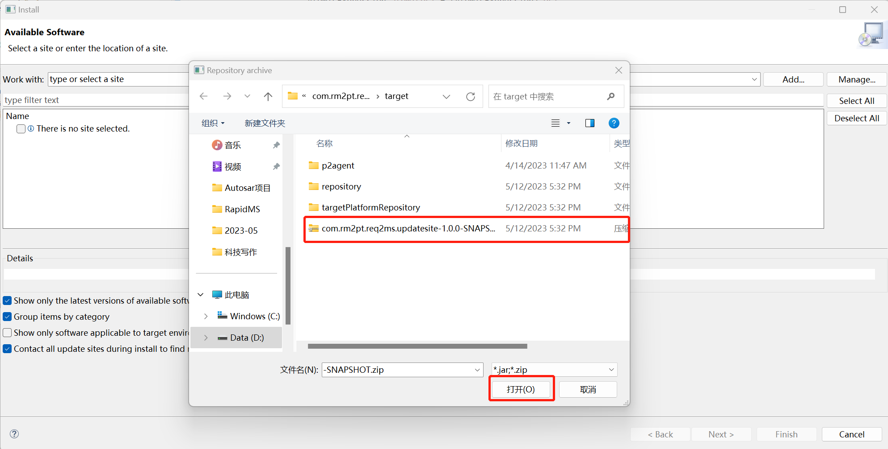
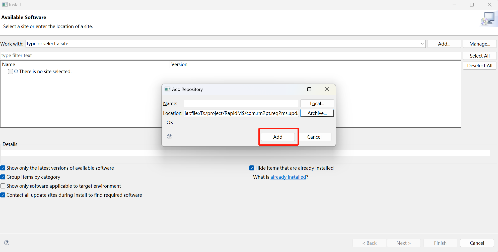
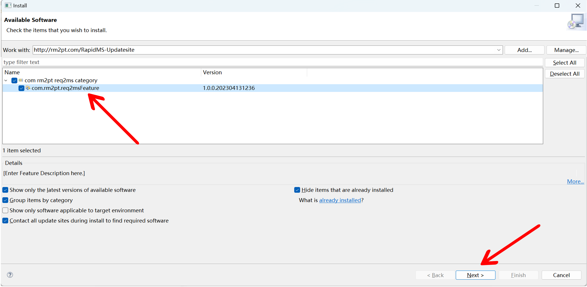
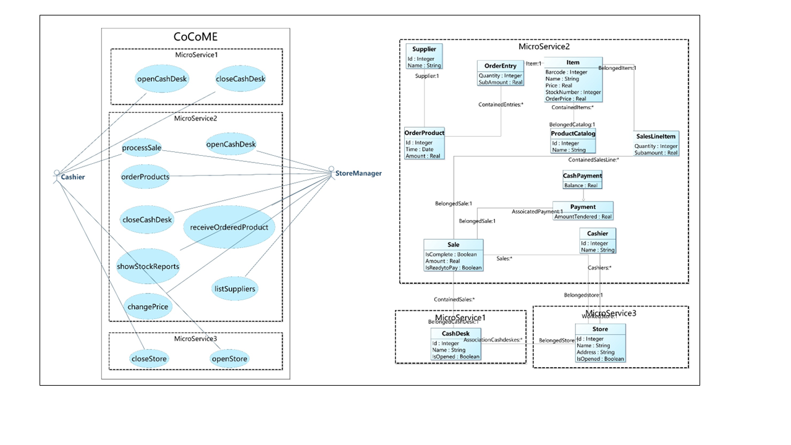
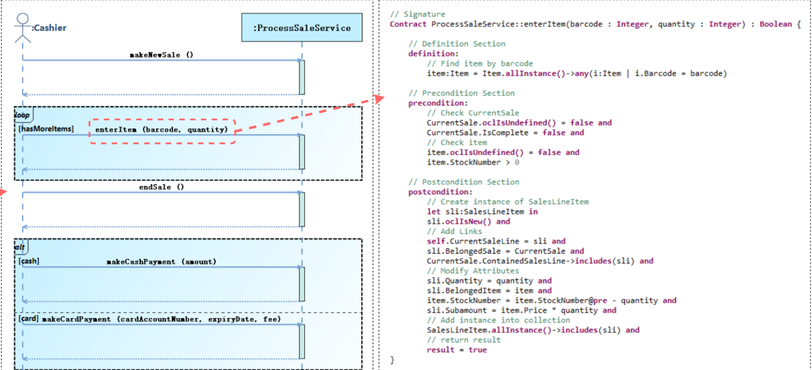
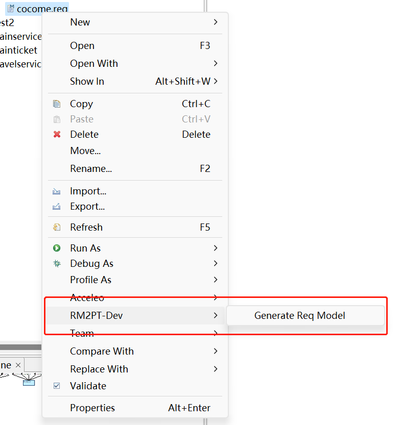
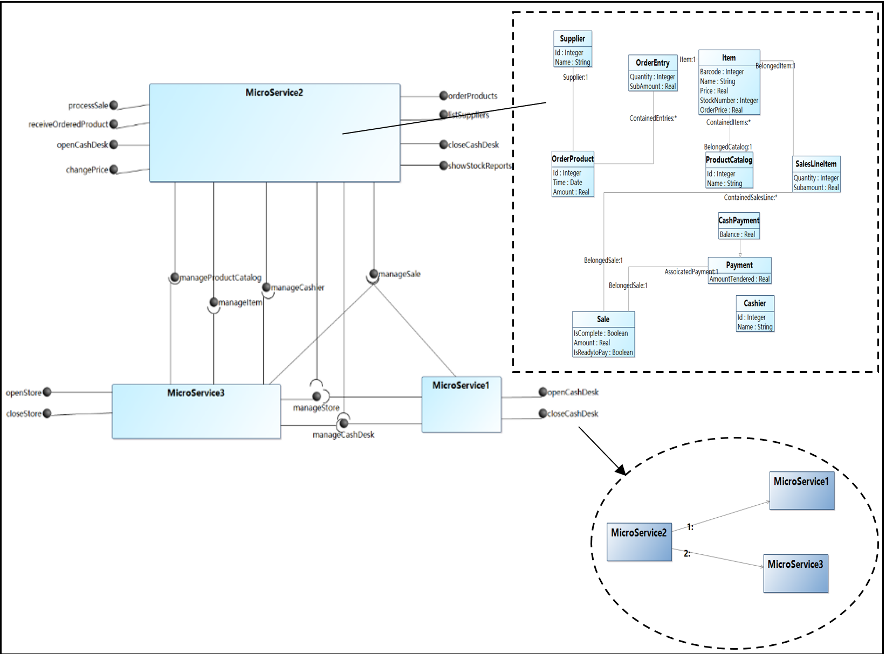

## Introduction

**RapidMS** is a Tool to Support Rapid *Microservice Architecture* Generation and Refinement from *Requirements Model*. The **benefits** of RapidMS are as follows:

1. Automated microservice architecture diagram generation.
2. Automated inter-microservice communication diagrams generation.

The video cast its feature is listed as follows (Youtube):

<iframe class="uk-width-1-3@m" width="560" height="315" src="https://www.youtube.com/watch?v=H-zFJJxEgq4&t=3s" frameborder="1" allow="accelerometer; autoplay; encrypted-media; gyroscope; picture-in-picture" allowfullscreen>RapidMS Youtube Video</iframe>

## Download and Installation

RapidMS is an advanced feature of **RM2PT**. It can automatically identifiy the microservices from requirements models.

### Prerequest

RapidMS is a plugin of RM2PT. If you don't have RM2PT, download [here](https://rm2pt.com/downloads/).

### Installation of RapidMS

Open RM2PT, click on `Help` -> `Install New Software`

Type http://rm2pt.com/RapidMS-UpdateSite in the Work with field, select RapdiMS and click Next.

**If the update site does not work**, you can choose to install it offline. Click [here](https://github.com/RM2PT/RapidMS-UpdateSite/releases/download/v1.0.0/com.rm2pt.req2ms.updatesite-1.0.0-SNAPSHOT.zip) to download RapidMS. Follow the steps below to install.

## RapidMS Overview

### Input of RapidMS — Extended Requirements Model

The input to RapidMS is a UML requirements model with OCL constraints. The model includes: a conceptual class diagram, a use case diagram, system sequence diagrams, contracts of system operations.

- **A conceptual class diagram:** A conceptual class diagram is a concept-relation model, which illustrates abstract and meaningful concepts and their relations in the problem domain, in which the concepts are specified as classes, the relations of the concepts are specified as the associations between the classes, and the properties of the concepts are specified as the attributes of the classes.

- **A use case diagram:** A use case diagram captures domain processes as use cases in terms of interactions between the system and its users. It contains a set of use cases for a system, actors represented a type of users of the system or external systems that the system interacts with, the relations between the actors and these use cases, and relations among use cases.

- **System sequence diagrams:** A system sequence diagram describes a particular domain process of a use case. It contains the actors that interact with the system, the system and the system events that the actors generate, their order, and inter-system events. Compared with the sequence diagram in design models, a system sequence diagram treats all systems as a black box and contains system events across the system boundary between actors and systems without object lifelines and internal interactions between objects.

- **Contracts of system operations:** The contract of a system operation specifies the conditions that the state of the system is assumed to satisfy before the execution of the system operation, called the pre-condition and the conditions that the system state is required to satisfy after the execution (if it terminated), called the post-condition of the system operation. Typically, the pre-condition specifies the properties of the system state that need to be checked when system operation is to be executed, and the postcondition defines the possible changes that the execution of the system operation is to realize.

### The identified microservices in the requirements models

You can generate microservice model by right click on `cocome.remodel` -> `RM2PT-Dev`-> `generate req model`

The generated model is in the ReqModel folder  

  

### The Output of RapidMS

The microservice architecture model consists of a architecture diagram and inter-microservice communication diagrams. 

**Microservices architecture diagram** comprehensively represents an architecture, illustrating all microservices within a system and their inter dependencies. It encompasses the internal class diagram for each microservice, targeting the entity information contained therein. Furthermore, the microservices architecture diagram delineates the interfaces each microservice provides and requires and the operations within specific interfaces. 

**Inter-microservice** communication diagram is a graphical representation of the interactions between services, showing the sequence of messaging and interactions between services.

CoCoME includes the processes of the cash register, such as scanning products with barcode scanner or paying with credit card or cash, and the management processes of the supermarket, such as replenishing supermarket products and modifying commodity prices. For more details of the , please see [GitHub - RM2PT/CaseStudies: RM2PT CaseStudies](https://github.com/RM2PT/CaseStudies).

The image below shows a part of CoCoME's microservice design model generated by RapidMS.

