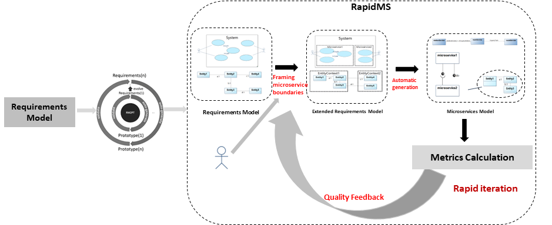

Download and use of RapidMS can be found [here](https://rm2pt.com/advs/rapidms)..

### Introduction

**RapidMS** is a Tool to Support Rapid *Microservice Architecture* Generation and Refinement from *Requirements Model*. The **benefits** of RapidMS are as follows:

1. Automated microservice architecture diagram generation.
2. Automated inter-microservice communication diagrams generation.

### Input of RapidMS — Requirements Model With Boundary

The input to RapidMS is a UML requirements model with OCL constraints. The model includes: a conceptual class diagram, a use case diagram, system sequence diagrams, contracts of system operations.

- **A conceptual class diagram:** A conceptual class diagram is a concept-relation model, which illustrates abstract and meaningful concepts and their relations in the problem domain, in which the concepts are specified as classes, the relations of the concepts are specified as the associations between the classes, and the properties of the concepts are specified as the attributes of the classes.

- **A use case diagram:** A use case diagram captures domain processes as use cases in terms of interactions between the system and its users. It contains a set of use cases for a system, actors represented a type of users of the system or external systems that the system interacts with, the relations between the actors and these use cases, and relations among use cases.

- **System sequence diagrams:** A system sequence diagram describes a particular domain process of a use case. It contains the actors that interact with the system, the system and the system events that the actors generate, their order, and inter-system events. Compared with the sequence diagram in design models, a system sequence diagram treats all systems as a black box and contains system events across the system boundary between actors and systems without object lifelines and internal interactions between objects.

- **Contracts of system operations:** The contract of a system operation specifies the conditions that the state of the system is assumed to satisfy before the execution of the system operation, called the pre-condition and the conditions that the system state is required to satisfy after the execution (if it terminated), called the post-condition of the system operation. Typically, the pre-condition specifies the properties of the system state that need to be checked when system operation is to be executed, and the postcondition defines the possible changes that the execution of the system operation is to realize.

### Two main features
RapidMS provides a method to generate microservice architecture models from requirements models automatically. In this section, we introduce the architecture of RapidMS. RapidMS takes validated requirements models with boundaries defined by architects as input and generates microservice architecture models.

#### Generation of Microservice Architecture Diagram
The microservice architecture diagram depicts the static structure of the system's design, encompassing microservice components, interfaces, and internal conceptual class diagrams. RapidMS begins by converting use case diagram boundaries into microservices. This process yields a set of system operations corresponding to each microservice, which are packaged into an interface, facilitating direct user access for invocation. Next, the boundaries of the corresponding conceptual class diagram transform into the microservices' internal conceptual class diagram, wherein entities and entity relationships remain unchanged. 

First, RapidMS disconnect the relationships between entities in different microservices and generate a pair of ProvideInterface and RequiredInterface, named manage + Entity, for each microservice to represent the CRUD (Create, Read, Update, Delete) operations on the entities. Next, we directly map the use cases to the provided interface to represent the operations provided by the microservice to the external environment. Finally, we map the invocation operations specified in the Object Constraint Language (OCL) to the required interface, allowing for communication and interaction between microservices.
#### Generation of Inter-Microservice Communication Diagram

The inter-microservice communication diagrams illustrate the dynamic interaction between microservices in terms of how microservices invoke required interfaces to accomplish microservice operations. RapidMS generate inter-microservice communication diagram. Every usecase will generate a inter-microservice communication diagram representing order of microservice operations invoking other microservice operations. Our method defines an ordered collection of pairs which is called Invocation. Each of these elements is a vector containing three elements invo(OP, A, op, B), which means operation OP invoke Operation op in microservice A, and then Operation OP need the interface provided in Microservice B.
\begin{equation}
Invocatrion =List\left(invo\left(OP, MSA, op, MSB\right)\right)
\end{equation}

Our approach generates the Invocation first. To determine which microservices are included in this diagram. We traverse the set of all system operations contained in the usecase's system sequence diagram in turn and retrieve their corresponding contracts. Included in the OCL are CRUD operations on entities and calls to other methods of the system.Then, we generate inter-microservice communication diagrams based on UML communication diagrams to depict the sequence of operations calls between microservices. These communication diagrams visually represent the interactions and message exchanges between microservices, showcasing the flow of control and data during the execution of system functionalities. They facilitate a comprehensive understanding of microservices' communication patterns and dependencies, enabling architects and developers to analyze and optimize the system's overall behavior and performance.

### CoCoME Case Study

To illustrate the RapidMS’s capabilities, CoCoME is used as an example to demonstrate the requirements model, and the corresponding generated design model.

The image below shows a part of CoCoME's microservice architecturemodel. For more details, please see https://github.com/RM2PT/CaseStudies.

#### Output
