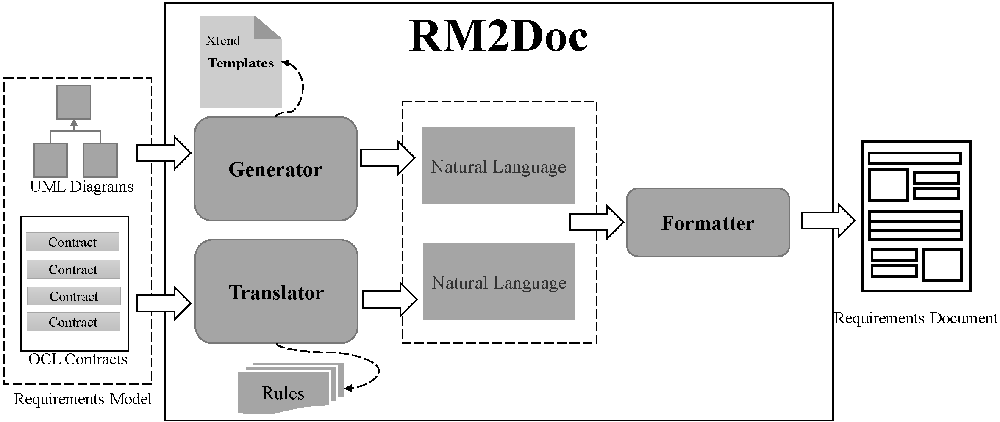

### Introduction

**RM2Doc** is a tool for automatic generation of a *requirements document* from a *requirements model*. The **benefits** of RM2Doc are as follows:

1. Automatic generation of ISO/IEC/IEEE 29148-2018 conformed requirements documents from UML models without any templates.
2. Automatic generation of the flow description from a use case without additional information.
3. Automatic generation the semantic description of system operations only based on the formal expression of OCL.

### RM2Doc Download

Click [here](https://github.com/Tians996/RM2Doc-Tool/raw/main/com.rm2pt.generator.rm2doc.updatesite-1.0.0-SNAPSHOT.zip) to download.

### RM2Doc Install

Install in rm2pt, if you don't have rm2pt, [download here](https://github.com/RM2PT/Release/releases)

### Create or import a project

For creating or importing a RM2PT project，you can see the tutorial [here](https://rm2pt.com/tutorial/user/create_new_project).

### Generate comments for contracts

After you add a requirements model, you can generate comments for contracts by right click on `cocome.remodel` -> `RM2Doc`-> ` RM2Doc Generate comments for contracts`

Refresh your remodel file to see the generated comments

### Generate a document

You can generate document by right click on `cocome.remodel` -> `RM2Doc` -> `RM2Doc Generate document for models`

The generated document is in the doc-gen folder
