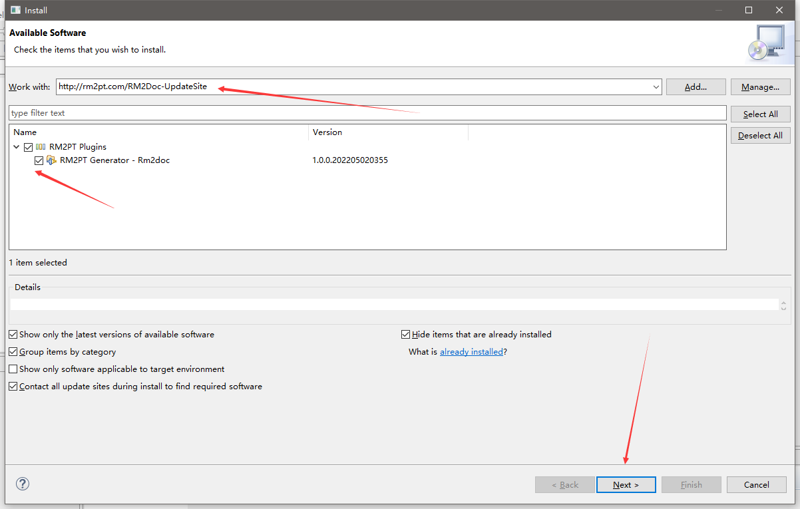
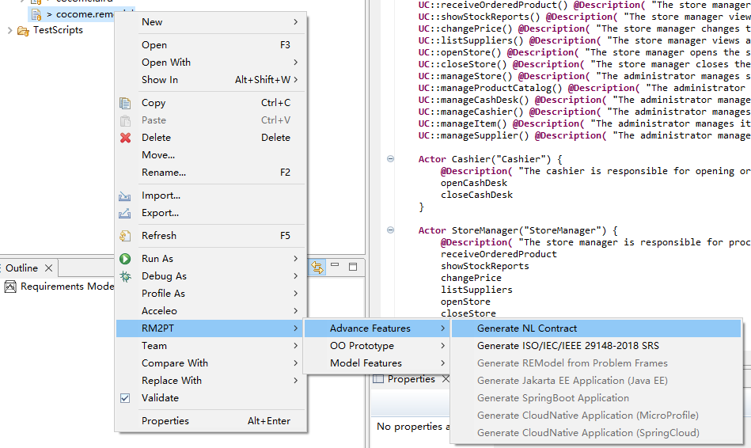
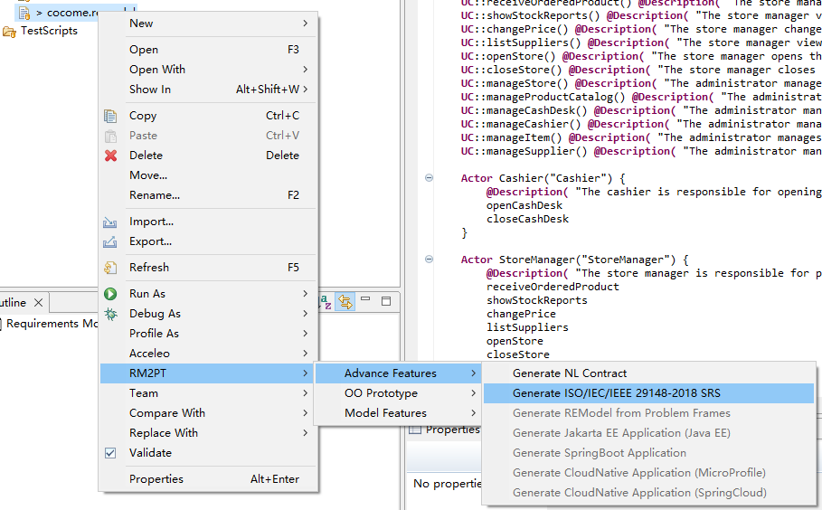
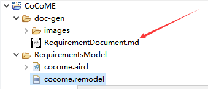
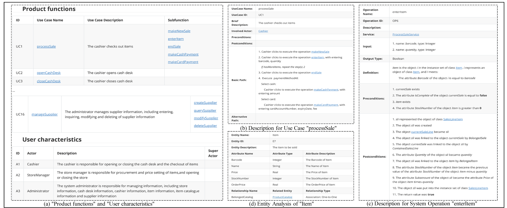

## Introduction

**RM2Doc** is a tool for automatic generation of a *requirements document* from a *requirements model*. The **benefits** of RM2Doc are as follows:

1. Automatic generation of ISO/IEC/IEEE 29148-2018 conformed requirements documents from UML models without any templates.
2. Automatic generation of the flow description from a use case without additional information.
3. Automatic generation the semantic description of system operations only based on the formal expression of OCL.

The video cast its feature is listed as follows (Youtube):
<iframe class="uk-width-1-3@m" width="560" height="315" src="https://www.youtube.com/embed/4z0Z5mrLfBc" frameborder="1" allow="accelerometer; autoplay; encrypted-media; gyroscope; picture-in-picture" allowfullscreen>RM2Doc Youtube Video</iframe>

## RM2Doc Installation
### Prerequest

RM2Doc is an advanced feature of **RM2PT**. We recommend you to use RM2Doc in RM2PT. If you don't have RM2PT, download [here](https://rm2pt.com/downloads/).

### Online Installation
Open RM2PT, click on `Help` -> `Install New Software`

Type http://rm2pt.com/RM2Doc-UpdateSite in the Work with field, select RM2Doc and click Next.

### Offline Installation

**If the update site does not work**, you can choose to install it offline. Click [here](https://github.com/RM2PT/RM2Doc-UpdateSite/releases/download/v1.0.0/com.rm2pt.generator.rm2doc.updatesite-1.0.0-SNAPSHOT.zip) to download RM2Doc. Follow the steps below to install.

## RM2Doc Tutorial

### Prerequest

In order to generate the documentation, you need a requirements model, the **RM2PT project**. For creating or importing a RM2PT project，you can see the tutorial [here](https://rm2pt.com/tutorial/user/create_new_project).

### Input of RM2Doc — Requirements Model

The input to RM2Doc is a UML requirements model with OCL constraints. The model includes: , a use case diagram, system sequence diagrams, contracts of and system operations.

- **A conceptual class diagram:** A conceptual class diagram is a concept-relation model, which illustrates abstract and meaningful concepts and their relations in the problem domain, in which the concepts are specified as classes, the relations of the concepts are specified as the associations between the classes, and the properties of the concepts are specified as the attributes of the classes.

- **A use case diagram:** A use case diagram captures domain processes as use cases in terms of interactions between the system and its users. It contains a set of use cases for a system, actors represented a type of users of the system or external systems that the system interacts with, the relations between the actors and these use cases, and relations among use cases.

- **System sequence diagrams:** A system sequence diagram describes a particular domain process of a use case. It contains the actors that interact with the system, the system and the system events that the actors generate, their order, and inter-system events. Compared with the sequence diagram in design models, a system sequence diagram treats all systems as a black box and contains system events across the system boundary between actors and systems without object lifelines and internal interactions between objects.
- **Contracts of system operations:** The contract of a system operation specifies the conditions that the state of the system is assumed to satisfy before the execution of the system operation, called the pre-condition and the conditions that the system state is required to satisfy after the execution (if it terminated), called the post-condition of the system operation. Typically, the pre-condition specifies the properties of the system state that need to be checked when system operation is to be executed, and the postcondition defines the possible changes that the execution of the system operation is to realize.

### Generate NL Contract

After you add a requirements model, you can generate NL contracts for OCL contracts by right click on `cocome.remodel` -> `RM2PT`-> ` Advance Features`-> ` Generate NL Contract`

Refresh your remodel file to see the generated NL contracts.

### Generate SRS

You can generate a document by right click on `cocome.remodel` -> `RM2PT`-> ` Advance Features`-> ` Generate ISO/IEC/IEEE 29148-2018 SRS`

The generated document is in the doc-gen folder

### The Output of RM2Doc

RM2PT can generate five parts of a document:

- The **product functions** section and **user characteristics** section are generated from the use case diagram.
- The **use case description** part is generated from the use case diagram and system sequence diagrams.
- The **system operation description** part is generated from contracts of system operations.
- The **entity ananlysis** part  is generated from the conceptual class diagram.

In the rest of the requirements document, we have predefined guidelines for writing in accordance with the **ISO/IEC/IEEE 29148-2018**.

The image below shows a part of CoCoME's requirements document. For more details, please see <https://github.com/RM2PT/CaseStudies>.

