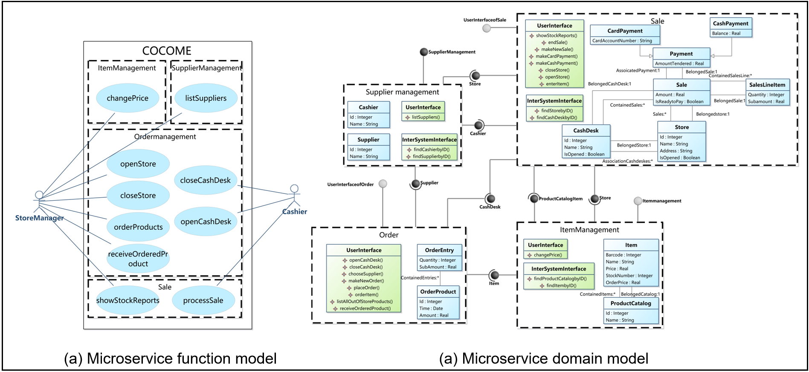

## Introduction

**RM2MS** is a tool can automatically identifiy microservices from the validated requirements model. The **benefits** of RM2MS are as follows:

1. Automated dependency extraction.

2. Automated microservices identification

3. Microservices visualization.

The video cast its feature is listed as follows (Youtube):

<iframe class="uk-width-1-3@m" width="560" height="315" src="https://www.youtube.com/embed/1PTBn7WLNiM" frameborder="1" allow="accelerometer; autoplay; encrypted-media; gyroscope; picture-in-picture" allowfullscreen>RM2MS Youtube Video</iframe>

## Download and Installation

RM2MS is an advanced feature of **RM2PT**. It can automatically identifiy the microservices from requirements models.

### Prerequest

RM2MS is a plugin of RM2PT. If you don't have RM2PT, download [here](https://rm2pt.com/downloads/).

### Installation of RM2MS

Open RM2PT, click on `Help` -> `Install New Software`

Type http://rm2pt.com/RM2MS-UpdateSite in the Work with field, select RM2MS and click Next.

**If the update site does not work**, you can choose to install it offline. Click [here](https://github.com/RM2PT/RM2MS-UpdateSite/releases/download/v1.0.0/com.rm2pt.generator.microservice.updatesite-1.0.0-SNAPSHOT.zip) to download RM2MS. Follow the steps below to install.

## RM2MS Tutorial

### Input of RM2MS — Requirements Model

The input to RM2MS is a UML requirements model with OCL constraints. The model includes: a conceptual class diagram, a use case diagram, system sequence diagrams, contracts of system operations.

- **A conceptual class diagram:** A conceptual class diagram is a concept-relation model, which illustrates abstract and meaningful concepts and their relations in the problem domain, in which the concepts are specified as classes, the relations of the concepts are specified as the associations between the classes, and the properties of the concepts are specified as the attributes of the classes.

- **A use case diagram:** A use case diagram captures domain processes as use cases in terms of interactions between the system and its users. It contains a set of use cases for a system, actors represented a type of users of the system or external systems that the system interacts with, the relations between the actors and these use cases, and relations among use cases.

- **System sequence diagrams:** A system sequence diagram describes a particular domain process of a use case. It contains the actors that interact with the system, the system and the system events that the actors generate, their order, and inter-system events. Compared with the sequence diagram in design models, a system sequence diagram treats all systems as a black box and contains system events across the system boundary between actors and systems without object lifelines and internal interactions between objects.

- **Contracts of system operations:** The contract of a system operation specifies the conditions that the state of the system is assumed to satisfy before the execution of the system operation, called the pre-condition and the conditions that the system state is required to satisfy after the execution (if it terminated), called the post-condition of the system operation. Typically, the pre-condition specifies the properties of the system state that need to be checked when system operation is to be executed, and the postcondition defines the possible changes that the execution of the system operation is to realize.

### The identified microservices in the requirements models

You can generate microservice model by right click on `cocome.remodel` -> `RM2PT-Dev`-> `generate microservice model`

You can output the initial number of `iteration` and `population` in the genetic algorithm  

The generated model is in the ReqModel folder  

  

### The Output of RM2MS

RM2MS introduce the concept of bounded context on the usecase model and concept class diagram aiming to present the decomposition of system functions and system database separately. In addition, provide-interface and receive-interface are defined on the domain context boundary to represent microservices interface information.  RM2MS converts the microservices architecture solution to microservices design model,  which contains two parts:

- **The microservice function model**: Visualization the microservices **function** decomposition solution based on use case diagram.

- **The microservice domain model**: Visualization the microservices **data** decomposition and interface generation solution based on domain model.

CoCoME includes the processes of the cash register, such as scanning products with barcode scanner or paying with credit card or cash, and the management processes of the supermarket, such as replenishing supermarket products and modifying commodity prices. For more details of the , please see [GitHub - RM2PT/CaseStudies: RM2PT CaseStudies](https://github.com/RM2PT/CaseStudies).

The image below shows a part of CoCoME's microservice design model generated by RM2MS.

As we can see, RM2MS decomposes CoCoMe into four microservices, namely OrderMicroservice, ItemMicroservice, SupplierMicroservice and SaleMicroservice. In the domain requirement model, not only the entity information contained in each microservice is displayed, but also the functions provided to users and the interfaces for calling between microservices are displayed. In addition, RM2MS can also generate a functional microservice model to describe the system's functional decomposition scheme in more detail.