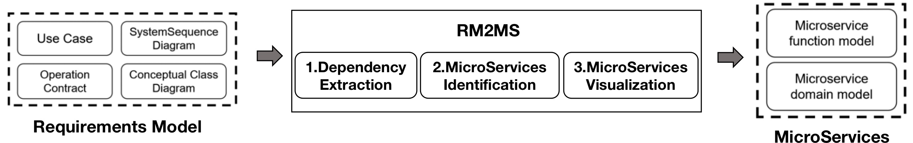
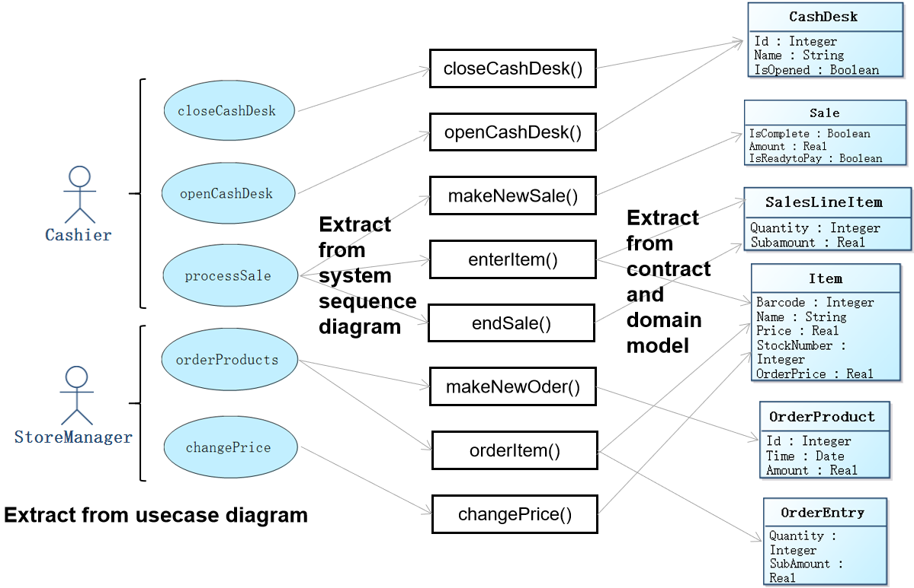
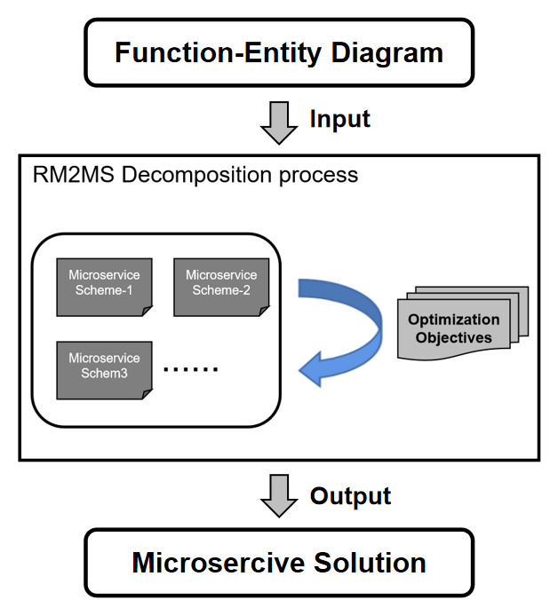

Download and use of RM2MS can be found [here](https://rm2pt.com/advs/rm2ms).

### Introduction

**RM2MS** is a tool can automatically identifiy microservices from the validated requirements model. The **benefits** of RM2MS are as follows:

1. Automated dependency extraction.
2. Automated microservices identification
3. Microservices visualization.

### Input of RM2MS — Requirements Model

The input to RM2MS is a UML requirements model with OCL constraints. The model includes: a conceptual class diagram, a use case diagram, system sequence diagrams, contracts of system operations.

- **A conceptual class diagram:** A conceptual class diagram is a concept-relation model, which illustrates abstract and meaningful concepts and their relations in the problem domain, in which the concepts are specified as classes, the relations of the concepts are specified as the associations between the classes, and the properties of the concepts are specified as the attributes of the classes.

- **A use case diagram:** A use case diagram captures domain processes as use cases in terms of interactions between the system and its users. It contains a set of use cases for a system, actors represented a type of users of the system or external systems that the system interacts with, the relations between the actors and these use cases, and relations among use cases.

- **System sequence diagrams:** A system sequence diagram describes a particular domain process of a use case. It contains the actors that interact with the system, the system and the system events that the actors generate, their order, and inter-system events. Compared with the sequence diagram in design models, a system sequence diagram treats all systems as a black box and contains system events across the system boundary between actors and systems without object lifelines and internal interactions between objects.

- **Contracts of system operations:** The contract of a system operation specifies the conditions that the state of the system is assumed to satisfy before the execution of the system operation, called the pre-condition and the conditions that the system state is required to satisfy after the execution (if it terminated), called the post-condition of the system operation. Typically, the pre-condition specifies the properties of the system state that need to be checked when system operation is to be executed, and the postcondition defines the possible changes that the execution of the system operation is to realize.

### Three main features

RM2MS tools takes the validated requirements model as imput. For the input requirements model, RM2MS first extracts the dependency diagram and then identifies the microservices based on it. Finally RM2MS converts the microservices architecture solution to microservices design model.

#### Dependency diagram extraction

RM2MS first extract the necessary elements and their corresponding relationships from the requirements model. RM2MS uses dependency diagram as the basis of microservices identification. dependency diagram has a **four tiered structure** cointains actor, usecase, system operation, entity as well as their relationship. The relationship between actor and usecase is obtained by analyzing the usecase diagram, and the relationship between usecase and system operation comes from the system sequence diagram. In addition, RM2MS further obtain the relationship between system operations and entities by analyzing system operation contracts which contains the CRUD operations on entities. Dependency diagram covers **complete system functions** and data information, which is not only applicable to the RM2MS microservices decomposing method, but also has great reference significance for manual microservices identification.

#### Automated microservices identification

The key to microservices decomposition is the decoupling of system function and the partitioning of databases. Based on dependency diagram, RM2MS searchs for different combinations of usecase and entity cluster solutions using 5 optimization objectives. In addition to this, RM2MS is initialized microservices design solutions with different granularities and uses a special microaervice solution mutation approach, making RM2MS has the ability to determine the number of generated microservices without manually specification like other tools. After multiple rounds of iterations, RM2MS obtained the optimal microservices architecture solution. The decomposing solution documents which use cases and entities are included in each microservices. Based on this information and the dependency diagram, RM2MS can further deduce the user interface and inter-microservices interface. 
To sum up, RM2MS considers more **comprehensive microservices decomposition factors**, realizes **dynamic granularity control**, and finally gives a complete microservices architecture solution.

#### Microservices visualization

RM2MS extends the original requirements model to support the **visualization** of microservices architecture and offered the corresponding **modelling tool**. RM2MS introduce the concept of bounded context on the usecase model and concept class diagram aiming to present the decomposition of system functions and system database separately. In addition, provide-interface and receive-interface are defined on the domain context boundary to represent microservices interface information. The provide-interface is divided into two types according to different interface receivers: The user interface directly provides users with system functions, and the inter-microservices interface is used to represent the calls between microservices. RM2MS converts the microservices architecture solution to microservices design model, making the solution more **standardized and usable**. Architects can also use this modeling tool for modeling microservices architectures. 

### CoCoME Case Study

To illustrate the RM2MS capabilities, CoCoME is used as an example to demonstrate the corresponding generated microservice design model.

CoCoME includes the processes of the cash register, such as scanning products with barcode scanner or paying with credit card or cash, and the management processes of the supermarket, such as replenishing supermarket products and modifying commodity prices.

The image below shows the microservice design model generated by RM2MS.

As we can see, RM2MS decomposes CoCoMe into four microservices, namely OrderMicroservice, ItemMicroservice, SupplierMicroservice and SaleMicroservice. In the domain requirement model, not only the entity information contained in each microservice is displayed, but also the functions provided to users and the interfaces for calling between microservices are displayed. In addition, RM2MS can also generate a functional microservice model to describe the system's functional decomposition scheme in more detail.