# overview-cocome0 Download and installation instructions

If you are searching a Chinese document, just click [here](cookbook_cn.md).

Up to now(2021.10), the latest version number is [v1.2.1](https://github.com/RM2PT/Release/releases/tag/v1.2.1), and [official repositor](https://github.com/RM2PT) offers 4 [examples](https://github.com/RM2PT/CaseStudies).

First, download the latest version at the link above.  Before unzipping the compressed package, you should configure the environment in advance. Make sure you have JDK11 on your computer,  if not, [AdoptOpenJDK](https://adoptopenjdk.net) is recommended. Don't forget to set folder where JDK located to system path. Then you can unzip the compressed package. Finally, double click the exe file `RM2PT` and enter the software.

# 1 Overview

## 1.1 RM2PT core components

Take [CoCoMe](https://github.com/RM2PT/CaseStudies) as an example, and its document directory is as follows:

│  .project
│
└─RequirementsModel
        cocome.aird
        cocome.remodel

After importing the project in RM2PT, it can be found that `cocome.aird` can also be expanded into three parts: **use case diagram**, **conceptual class diagram**, **system sequence diagram**.

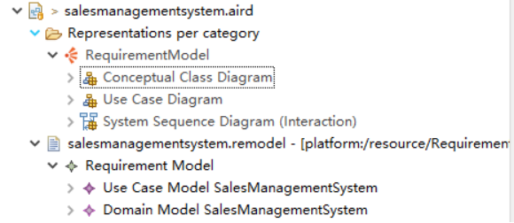

The corresponding code of each part can be found in `cocome.remodel`. In addition, the **system operation contract** needs to be written in `cocome.remodel`.

### 1.1.1 \*.aird file

The file realizes the function of XML metadata exchanging, parses the XML template document, identifies the information of the metadata, and completes the function of access and exchange of metadata. It can be intuitively understood as various UML diagrams. Among them, the three diagrams (use case diagram, conceptual class diagram, system sequence diagram) and system operation contract under the requirementmodel directory are the main operation areas.

### 1.1.2 \*.remodel file

Among them, `UseCaseModel` corresponds to use case diagram, sequence diagram and system operation contract. It is specific code logic; `Domainmodel` corresponds to the conceptual class diagram, that is, the definition of the class (only properties, not methods).

## 1.2 How to generate a runnable Prototype？

First, you need to complete the preparation of use case diagram, conceptual class diagram, system sequence diagram and system operation contract. After the above parts are completed, right-click \*.remodel file -> RM2PT -> OO Prototype -> Generate Desktop Prototype.

Then you can generate a runnable desktop program. Note that the generated project results will be in the directory at the same level as the original project(that is because we choose the option `Generate Desktop Prototype` rather than `Generate Desktop Prototype(Internal)`).

## 1.3 How do I run the generated Prototype？

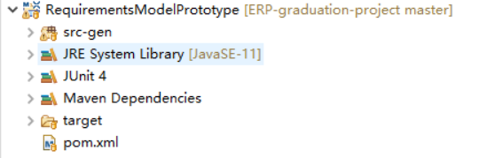

The above is the directory structure of the generated prototype program. Right click pom.xml - > run as - > Run configurations - > enter `exec: Java` in the goals column of the main tab - > run , as shown in the following figure.

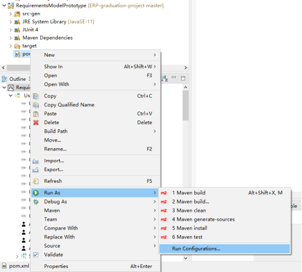

# 2 Specific drawing / coding method

This part takes the official example project COCOME as an example. In case of version difference, the COCOME under the folder shall prevail.

## 2.1 Use case diagram related components

The editing area of the use case diagram is as follows, mainly including canvas, shortcut toolbar and property bar.

In the shortcut toolbar( Platte ), click the object and then click the corresponding position on the canvas to add an object or relationship. After an object is selected, you can edit its properties in the property bar, such as object name, description, remark label, etc.

The corresponding code part of the use case diagram in the \*. remodel file is the part at the beginning of `UseCaseModel`, that is, the declaration of use cases and participants. During use, it is recommended to edit and modify the use case diagram directly, and try to avoid editing the \*.remodel file to modify the use case diagram.

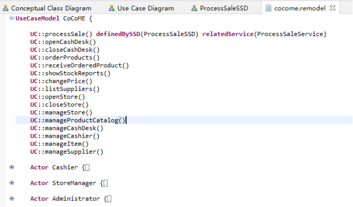

## 2.2 Related components of conceptual class diagram

The editing areas of concept class diagram mainly include canvas, shortcut toolbar and property bar.

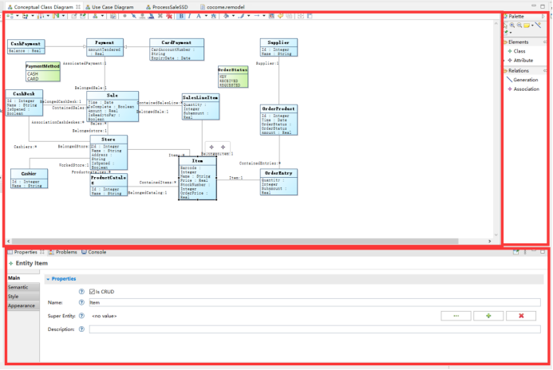

Click a component in the shortcut toolbar, and then click the corresponding position on the canvas to add an object or relationship.

Hover over the canvas and stay still for a period of time. A shortcut button (green plus sign) will appear. You can click the button to add a class.

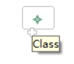

Click the class box and a shortcut button (purple plus sign) will appear. You can add attributes or enumeration types.

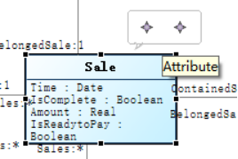

The attribute window of the class is as follows, mainly including: CRUD automatic generation options, class name and description. When the CRUD auto generation option is checked, the CRUD operation of this class can be automatically generated in `*.remodel`.

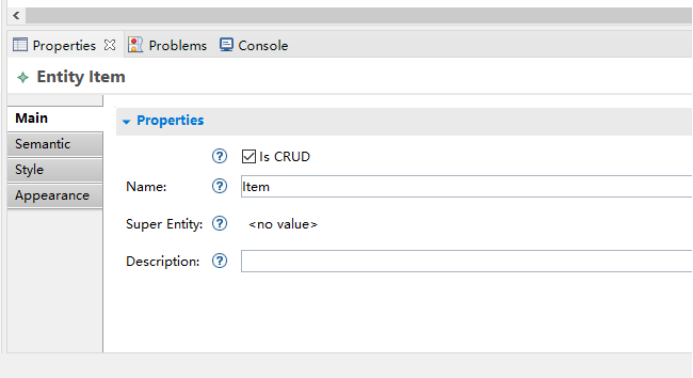

The attribute window of the attribute of class is as follows, mainly including attribute name and attribute type. Types include String, Integer, Real, Boolean, and Date.

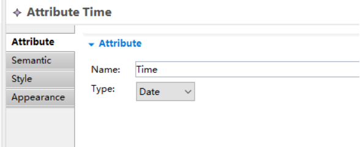

The attribute window of relationship is as follows, mainly including association name, relationship type and Multiplicity. In the class diagram of this tool, associations can be understood as references to objects of other classes held in class definitions in object-oriented languages. Taking the association in the following figure as an example, when the multiplicity is 1, it represents a one-to-one relationship, and `BelongedCatalog` represents that the item class definition holds a reference to a `ProductCatalog` object, that is, each item belongs to a product list; When the repeatability is \*, it indicates a one to many relationship. `Containeditems` indicates that the `ProductCatalog` class definition holds a collection referenced by an item object, that is, each product list contains multiple items. The relationship here will be used in the later contract writing.

The corresponding code part of the conceptual class diagram in the remodel file is the `DomainModel` part, that is, the declaration of classes and attributes.

Where "@AutoCRUD" corresponds to the automatic generation CRUD option of the class; The Entity header includes attributes and their type, `[Refer]` contains all the relationships of the class, "!" represents the reverse and "\*" represents the one to many relationship; `[INV]` is the constraint condition of the class, which is written in OCL (object constraint language) as the operation contract.

## 2.3 Sequence diagram related components

The function of sequence diagram: to represent a group of operations with logical sequence. Take COCOME as an example. During checkout, cashier needs to complete the following steps in sequence, and each step depends on the successful execution of the previous step. A sequence diagram needs to be established for such cases.

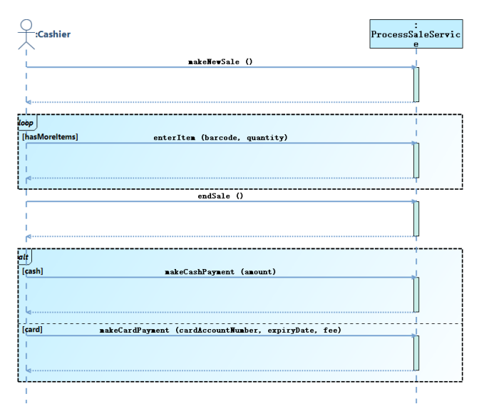

Creation method of sequence diagram: double click a use case in the use case diagram to create the corresponding sequence diagram for the use case, and create the corresponding `Interaction` and `Service` in the remodel file at the same time.

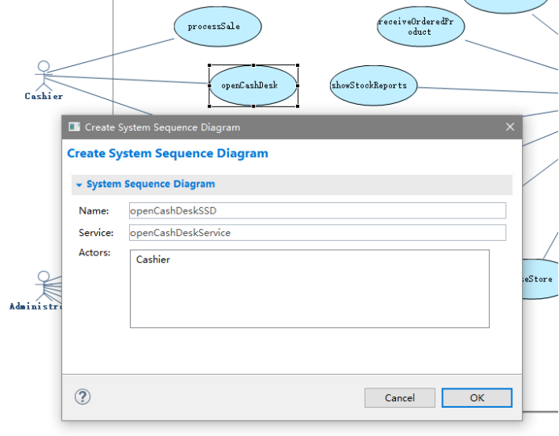

The editing area of the sequence diagram also includes the canvas, toolbar and property bar. Note that you need to drag `Execution` to the dotted line corresponding to the `Service`, and then add `CallMessage`. The property bar of `CallMessage` is as follows, including the corresponding system operation and system operation parameters.

The property bar of the `CombinedFragment` is as follows, including a drop-down menu to select loop or alt.

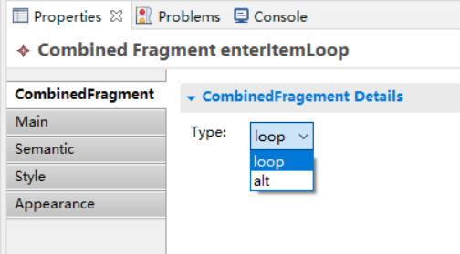

The property bar of Operand (a component of `CombinedFragment`) includes: the name of the operation, the start and finish positions of the operation.

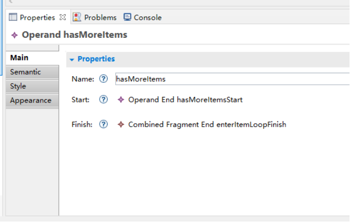

The sequence diagram in remodel mainly works in the following places:

first, at the use case declaration in `UseCaseModel`, the use case will be bound with the SSD and Service automatically created when creating the sequence diagram.

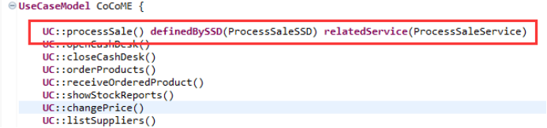

Second, after adding at least one `CallMessage` and saving it, remodel file will automatically generate the corresponding description. This description is almost unreadable and is not recommended for modification.

Third, the corresponding Service will be generated below, and an Operation will be generated for each CallMessage and corresponding parameters in the sequence diagram. It is recommended to edit the sequence diagram here. Editing remodel may make the sequence diagram unable to be saved.

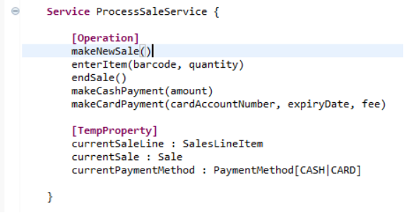

In case of problems that cannot be saved, you can save the code, and then remove the previously bound code in the visual interface. Then rebind service and SSD, and paste back the previous code selectively.

## 2.4 Operating contract related components

The operation contract is the `Contract` in the remodel file. The operation contract constitutes the specific implementation of the use case.

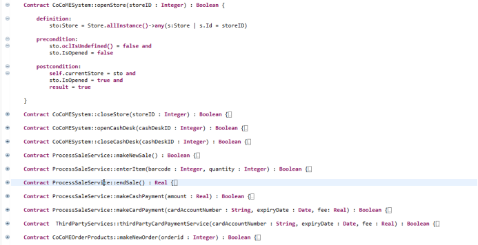

### 2.4.1 The relationship between Contract and Service, and the corresponding relationship between use cases and operations

Service is a series of operations in the flowchart. For example, the previous `ProcessSaleService` includes many operations to achieve the purpose of payment.

**Service is the container of Contracts**. All contracts need to be declared in a service before they can be called successfully. Logically, a service is a collection of contracts, and related contracts should be classified in the same service.

A use case can correspond to one operation or multiple operations. Here are 2 examples:

A use case corresponds to an operation: take `openStore` as an example, the participant is `storeManager`, and the service belongs to `CoCoMESystem`. Use cases and actions are bound by the same name.

A use case corresponds to multiple operations: take `processSale` as an example, and its participant is `Cashier`. As shown in the following figure: the "Contract" is declared under "[Operation]", where the parameter type of the contract does not need to be declared; In addition, you can declare some temporary variables whose scope is limited to the service (such feature is used for variable transmission in Service)

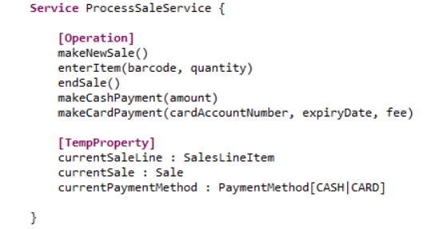

### 2.4.2 Contract details

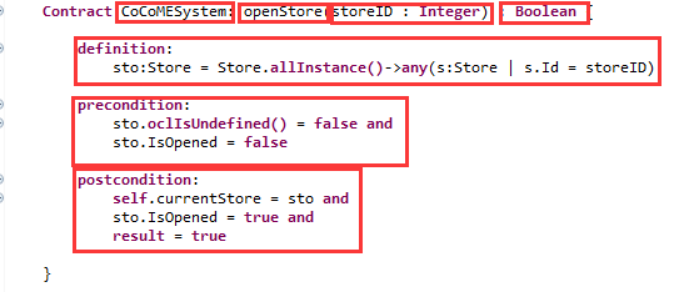

BTW, The `Store` above is an Entity defined in CoCoME.

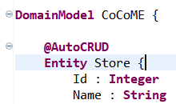

Contract includes: Service, Contract name, parameters, return value type, definition, precondition and postcondition. Note that the variable name of the parameter needs to start with lowercase and be the same as the variable name declared in the service. Definition usually completes the query operation; Precondition is condition that must be met before. Postcondition can be entered only when the Precondition of this part is true; Postcondition is condition that must be met after. When the Precondition result is true, the Postcondition statements are executed one by one. Finally, the return result needs to be defined, and the data type of the result needs to be the same as the previously defined return value type.

Here is a contract with comments.

The official explanation of the small arrow (->):

> Collections, like Sets, OrderedSets, Bags, and Sequences are predefined types in OCL. They have a large number of predefined operations on them. A property of the collection itself is accessed by using an arrow ‘->’ followed by the name of the property.

The official documents are placed in the directory, and more can be consulted.

# 3 Some tips

## 3.1 AutoCRUD

Check the "Is CRUD" option in the property column of the use case of the conceptual class diagram, or mark "@AutoCRUD" in the domain model of the remodel file, then you can automatically generate CRUD (create, find, modify, delete) for this class. The specific steps are as follows: right click anywhere in the remodel file - > rm2pt - > generate crud \*. Users can use `Generate CRUD UseCase`, `Generate CRUD Service` and `Generate CRUD Contracts` to create use cases, services and operation contracts for this class.

Note: the generated code is inserted at the cursor.

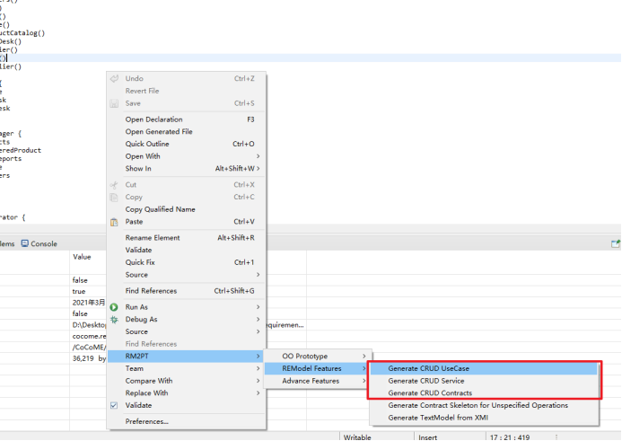

## 3.2 How to find bugs in remodel file

If the contract in the remodel file is not written correctly, the generated prototype will not execute correctly. The lexical analysis and syntax analysis of the remodel file by the tool are **not perfect** at present, which may bring difficulties to debug. At this time, you can debug through the generated prototype code.

With the help of eclipse's lexical and syntax check of Java code, the code in `src-gen/services.impl` directory in prototype can be compared with contract to quickly locate errors.

## 3.3 Save at any time（Ctrl+S）

Form the habit of saving every time you edit. The more often, the better. In this way, when a problem cannot be saved, the error source can be located in time.

## 3.4 Do not duplicate names

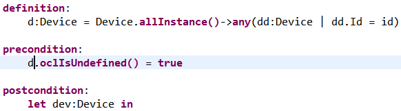

As shown in the figure, it should be noted that the variable name declared in postcondition cannot be the same as the previous one, because the generated java code will be named here.

# 4 Some common requirements

## 4.1 How to handle multivariable declaration and sharing in contract

As shown in the figure, there is a requirement to create a device, where the device has an attribute of Position and type of Point. How to create a Device instance?

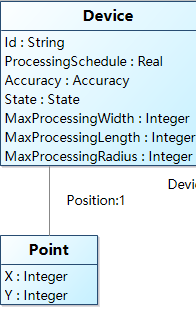

An intuitive idea is to declare directly, like this:

`let dev:Device, pt:Point`

Then assign a value

`dev.Position = pt`

Unfortunately, such an approach has not appeared in the OCL specification, and the actual operation of the current version (V1.2.1) is not feasible.

A feasible approach is to use the feature that `TempProperty` can be defined in the service. First declare a Point in a contract and then save it with an intermediate variable. Declare a device in another contract and obtain the intermediate variable as its Position property. Pay attention to it when using. Use `self.xxx` when assigning values and use `xxx` directly when taking values.

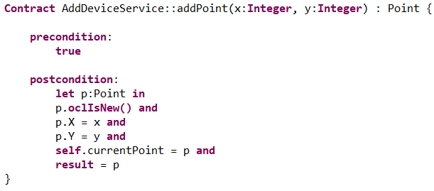

## 4.2 Use of conditional statements

This contract realizes the function of query or new creation.
