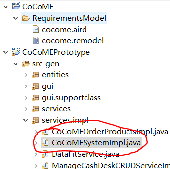
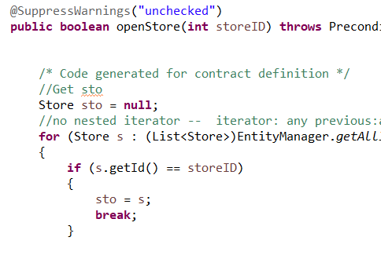
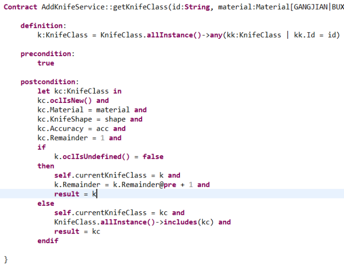

# 简介

OCL（Object Constraint Language）是描述UML模型的表达式的语言（expressions on UML

models）。可以用作查询语言，描述操作约束等。

# 大致结构

这里简单说一下在RM2PT中OCL的大致的结构，更详细OCL标准的还请参见官方文档。

在RM2PT中OCL约束是写在Contact中的，以下图作为例子


可以看见大体的结构分为3块，分别是definition、precondition、postcondition

`definition`部分是声明，对于上图来说，这里的`sto:Store`相当于java中的`Store sto`，等号后面的`Store.allInstance()->any(s:Store | s.id = storeID)`可翻译为下述代码

```java
for (Store s : (List<Store>)EntityManager.getAllInstancesOf("Store"))
{
    if (s.getId() == storeID)
    {
        sto = s;
        break;
    }
}
```

原OCL的`Store.allInstance()`即为获取所有的Store实例，`->any`引用了预先定义好的any方法，any方法的参数即为条件，这里要求：s是Store对象而且满足s的id和storeID相同。

`precondition`部分可以简单理解为条件，官方的解释是

> States a condition that must be true at the moment when an operation starts its execution.

`postcondition`部分可以简单理解为行为，官方的解释是

> States a condition that must be true at the moment when an operation ends its execution.

综合precondition和postcondition两部分，上图的OCL语句就可以翻译为下述代码

```java
if (StandardOPs.oclIsundefined(sto) == false && sto.getIsOpened() == false)
{
    /* Logic here */
    this.setCurrentStore(sto);
    sto.setIsOpened(true);

    refresh();
    // post-condition checking
    if (!(this.getCurrentStore() == sto
          &&
          sto.getIsOpened() == true
          &&
          true)) {
        throw new PostconditionException();
    }

    //return primitive type
    refresh();				
    return true;
}
```

这样一个用OCL描述的`Contract`就能被转换为相应的java代码并运行，实际上RM2PT就是这么做的。

对于在用户手册中说过的CoCoME的例子，我们可以在`CoCoMEPrototype/src-gen/services.impl/CoCoMESystemImpl.java`中找到转换后的代码






# 快速入门常用OCL描述

## pre和post

```
precondition:
	...
postcondition:
	...
```

需要注意postcondition中声明的变量名不能和前面的重复，因为生成的java代码中命名会按照此处命名


## let声明

> Expression with local variables.

```
postcondition:
    let sto:Store in
    sto.oclIsNew() and
    ...
```

let声明的变量后续可以被使用

不过对于一个常见的需求，声明多个变量及共享，不能直接像这样

`let dev:Device, pt:Point`

然后赋值

`dev.Position = pt`

一个可行的做法是利用Service中可以定义TempProperty的特性，先在一个Contract中声明Point，再用一个中间变量保存，在另一个Contract中声明一个Device并获取此中间变量，作为其Position属性，使用时要注意，赋值时使用self.xxx，取值时直接xxx


## if-then-else逻辑处理



这段Contract实现了查询或新建的功能

## self

> Denotes the contextual instance.

引用定义的变量，常用来实现共享变量的需求，例如在`let声明`小节中所展示的例子

## result

> In a postcondition, denotes the result of an operation.

相当于java中的return，可以看见上述例子中都有result的身影

## 一些预定义的函数

在之前我们看到了`allInstance`被广泛使用

类似的还有

- `oclIsNew`
- `oclIsUndefined`
- `oclsTypeOf`

更多可以参见OCL标准

以一个带注释的Contract作为结尾，这里展示了常见的用法


