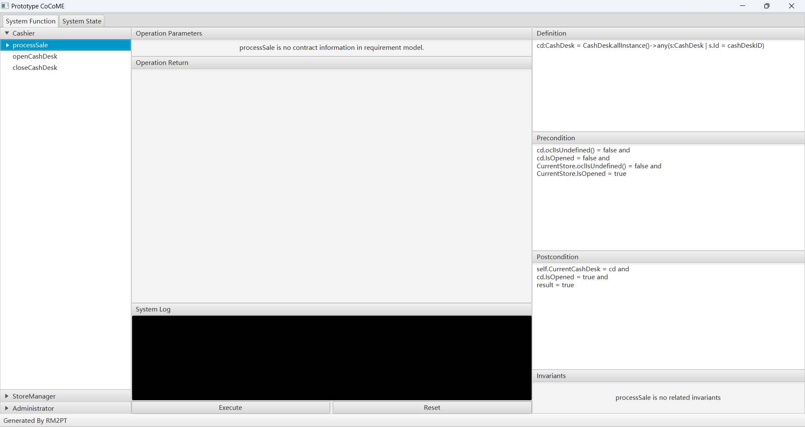
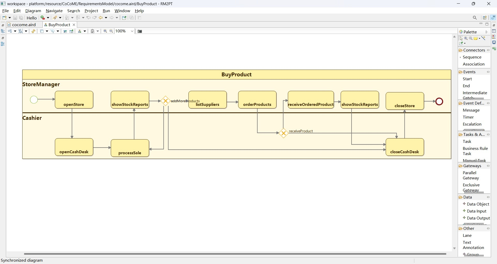
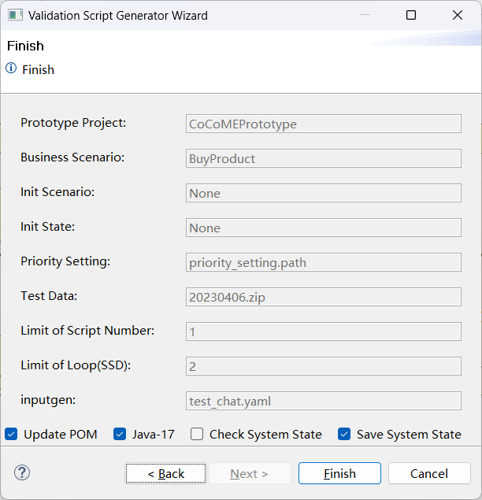

Download and use of ValidGen can be found [here](https://github.com/RM2PT/ValidGen-UpdateSite).

### Introduction
**ValidGen** is a tool for automatically generating the validation scripts to automatically execute the prototype without human interactions to Support Rapid Requirements Validation
. The **benefits** of ValidGen are as follows:

1. **Automatic validation script generation**. ValidGen can automatically analyze the requirements model and generating the validation scripts for requirement validation.

2. **Input data auto-loading**. ValidGen integrates the InputGen to automatically generate the input data for system operation, which does not need to prepare input data in advance and further simplifies the user’s process.

3. **Supporting rapid requirements validation**. Compared with manually operating the prototype system to complete the requirements validation, the time cost of using this tool is only about 40%, and the time cost including the construction of the scenario model is only about 60%.

### Input of VaildGen


The input to ValidGen is a System Sequence Diagram, a Scenario Model represented by BPMN Model, and an test data package which is optional.

- **System sequence diagrams:** A system sequence diagram describes a particular domain process of a use case. It contains the actors that interact with the system, the system and the system events that the actors generate, their order, and inter-system events. 
- **Scenario Model:** The scenario model mainly consists of use cases and some relations between use cases, which tells the tool which use cases need to be executed to show a business process and in what order.
- **Test Data: **Test data is an optional input, and users can specify some unique inputs according to their needs through this interface, which makes the tool more flexible.


### Main features
ValidGen can automatically generate automated validation scripts based on the Test-FX automation testing framework from a requirements model containing a system sequence diagram, a scenario model describing the relationship between use cases and external input test data so that users can efficiently complete the work of software requirements validation without manually operating the prototype system.

#### Automatic generation of valiation script
ValidGen can automatically analyze the requirements model to support generating the validation scripts for requirement validation. The tool can generate input data automatically, while the user can also specify some data according their needs.

#### Input data auto-loading

ValidGen integrates the InputGen to automatically generate the input data for system operation, which does not need to prepare input data in advance and further simplifies the user’s process.

#### Supporting rapid requirements validation
Compared with manually operating the prototype system to complete the requirements validation, the time cost of using this tool is only about 40%, and the time cost including the construction of the scenario model is only about 60%. This tool will boost the validation process.


### CoCoME Case Study

To illustrate ValidGen’s capabilities, CoCoME is used as an example to demonstrate the requirements model.

### Generate The Prototype

* First, you need to generate the prototype using the RM2PT.

* Second, you need to use inputgen to enhance the prototype.

  

### Build Scenario Model
Before using the tool to validate the requirements, you must build the scenario model by BPMN-Designer integrated with the tool. We mainly used three components in the BPMN model:

- The task represents the use case.
- Sequence Flow represents the association between use cases.
- Exclusive Gateway represents the branch node.



### Importing the initial data

Some initial data is required to initialize the inputgen. We have provided a sample of COCOME, which you can download [here](https://github.com/Map1e-fans/com.rm2pt.generator.testgen.remodel).

```yaml
Store:
- Id: 1
  Name: Walmart
  Address: Main
  IsOpened: false
- Id: 2
  Name: Target
  Address: Elm
  IsOpened: false
```

### Automatic generation of validation script

You can right-click the ".remodel" file, select the "Generate Validate Script" function, and a wizard window will appear. A validation script can be automatically generated after selecting the relevant attributes according to the prompts.





right-click the prototype project -> run as -> Maven Test.


### Evaluation Results
In the usability part, experiments were carried out for three requirements models. In terms of the number of automated validation scripts generated for each requirement model and the number of scripts that could automatically display relevant operations according to the content of the requirements model, a total of 48 scripts were generated in the experiment. Experiments show that the scripts generated by the three cases can perform relevant operations according to the information of the scenario model.

| Case Study | Number of Use Cases | Number of Generated Scripts | Number of Loops | Number of Branches | Number of Scripts that Display  Correctly |
| ---------- | ------------------- | --------------------------- | --------------- | ------------------ | ----------------------------------------- |
| cocome     | 15                  | 18                          | 3               | 2                  | 18                                        |
| libraryms  | 15                  | 17                          | 2               | 2                  | 17                                        |
| atm        | 14                  | 13                          | 2               | 1                  | 13                                        |
| sum        | 44                  | 48                          | 7               | 5                  | 48                                        |

In current practice, requirements validation requires users to operate the prototype system manually, and this part of the work is tedious and time-consuming. Fifteen experiments were also conducted using three requirements models to evaluate the tool’s effectiveness. After simple training for the experiment participants, the time cost of manually operating the prototype system and completing the requirements validation work with the help of the tool was calculated. Compared with manually operating the prototype system to complete the requirements validation, the time cost of using this tool to complete the requirements validation is only about 40%, and the time cost of considering the construction of the scenario model is only about 60%. The experimental results show that the tool can effectively improve the efficiency of requirements validation work.


| Case Study | Build Scenario Model | Number of Use Cases | Requirements Validation | Total  | Manually | Rate1  | $\frac {1}{Rate1}$ | Rate2  | $\frac{1}{Rate2}$ |
| ---------- | -------------------- | ------------------- | ----------------------- | ------ | -------- | ------ | ---- | ------ | ------- |
| cocome     | 127.93               | 15.33               | 226.20                  | 354.13 | 584.20   | 38.72% | 2.58 | 60.62% | 1.65    |
| libms      | 132.00               | 15.20               | 229.80                  | 361.80 | 481.07   | 39.71% | 2.51 | 62.52% | 1.60    |
| atm        | 98.27                | 14.67               | 213.55                  | 311.80 | 578.73   | 44.39% | 2.25 | 64.81% | 1.54    |
| average    | 119.40               | 15.07               | 223.18                  | 342.58 | 536.00   | 41.63% | 2.40 | 63.91% | 1.56    |

* **Rate1：**Time to use automated validation scripts for requirements validation/time to manually operate the prototype system for requirements validation.

* **Rate2：**(Time to use automated validation scripts for requirements validation + Time to build the scenario model) / time to manually operate the prototype system for requirements validation.

In summary, the automated validation script generation tool can effectively assist the requirements validation work, and the efficiency of requirements validation aided by this tool can significantly improve the efficiency of requirements validation compared with manual operation of the prototype system, which is a more efficient and straightforward solution.
