### Introduction

**ValidGen** is a tool for automatically generating the validation scripts to automatically execute the prototype without human interactions to Support Rapid Requirements Validation
. The **benefits** of ValidGen are as follows:

1. **Automatic validation script generation**. ValidGen can automatically analyze the requirements model to support generating the validation scripts for requirement validation.

2. **Input data auto-loading**. ValidGen integrates the InputGen to automatically generate the input data for system operation, which does not need to prepare input data in advance and further simplifies the user’s process.

3. **Supporting rapid requirements validation**. Compared with manually operating the prototype system to complete the requirements validation, the time cost of using this tool is only about 40%, and the time cost including the construction of the scenario model is only about 60%.

The video cast its feature is listed as follows (Youtube):

<iframe width="930" height="522" src="https://www.youtube.com/embed/sM96T4UJEeo" title="ValidGen" frameborder="0" allow="accelerometer; autoplay; clipboard-write; encrypted-media; gyroscope; picture-in-picture; web-share" allowfullscreen></iframe>

### ValidGen Installation

#### Prerequest

ValidGen is an advanced feature of **RM2PT**. We recommend you use ValidGen in RM2PT. If you don't have RM2PT, download it [here](https://rm2pt.com/downloads/).

#### Online Installation

Open RM2PT, click on `Help` -> `Install New Software`

Type https://map1e-fans.github.io/com.rm2pt.generator.validgen.release in the Work with field, select Validation Script Generator, and click Next.

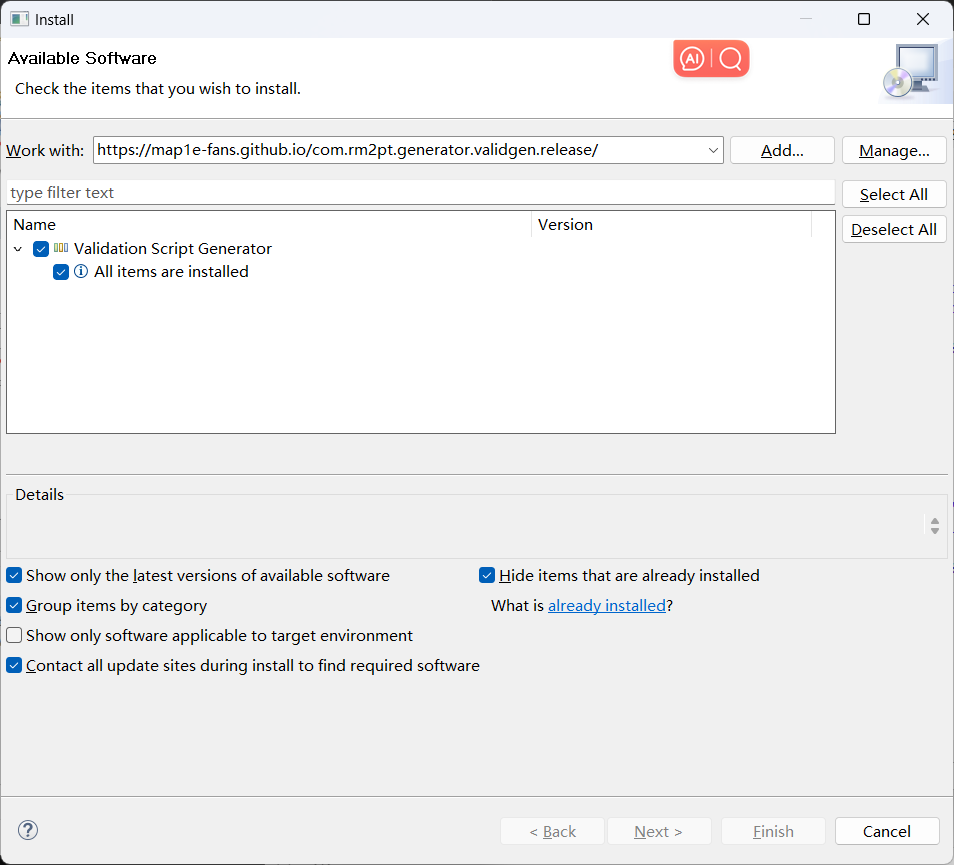

### Offline Installation

** **If the update site does not work**, you can choose to install it offline. Click [here](https://github.com/Map1e-fans/com.rm2pt.generator.validgen.release/releases/download/Release/ValidGen.jar) to download InputGen. Follow the steps below to install.

You can also download ValidGen installed in RM2PT [here](https://github.com/Map1e-fans/com.rm2pt.generator.validgen.release/releases/download/Release/RM2PT.with.ValidGen.zip).


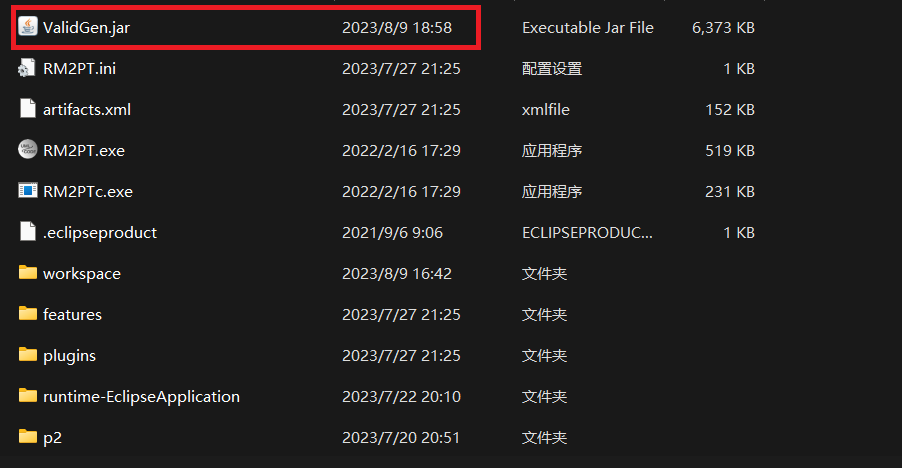

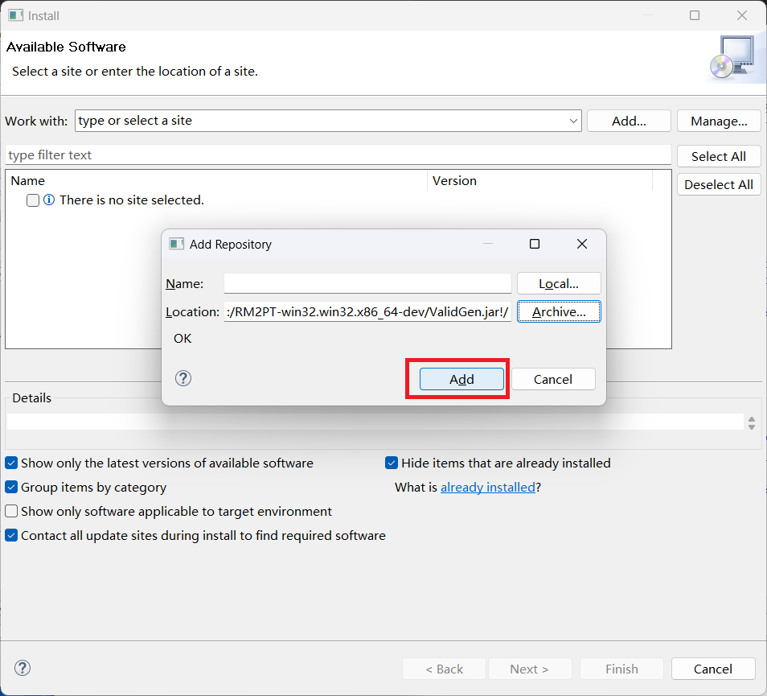

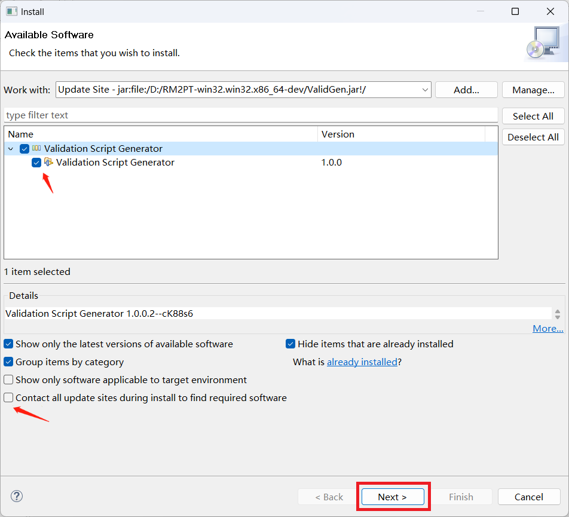

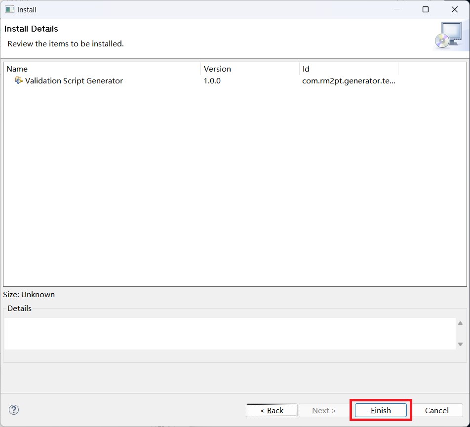

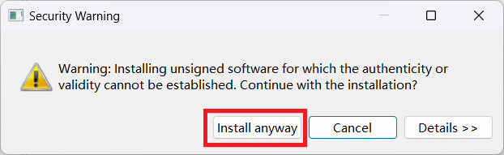

## ValidGen Tutorial

### Prerequest

In order to generate the validation script, you need a requirement model, the **RM2PT project**. For creating or importing a RM2PT project，you can see the tutorial [here](https://rm2pt.com/tutorial/user/create_new_project). We recommend importing RM2PT projects from Git, which is avaliable at [CaseStudies](https://github.com/Map1e-fans/com.rm2pt.generator.testgen.remodel). The tutorial is [here](https://rm2pt.com/tutorial/user/import_rm2pt_project).

### Input of VaildGen

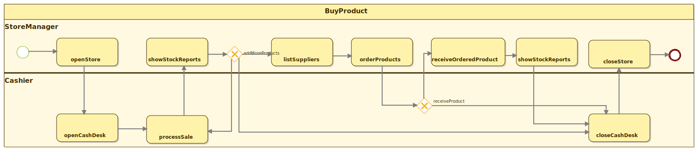

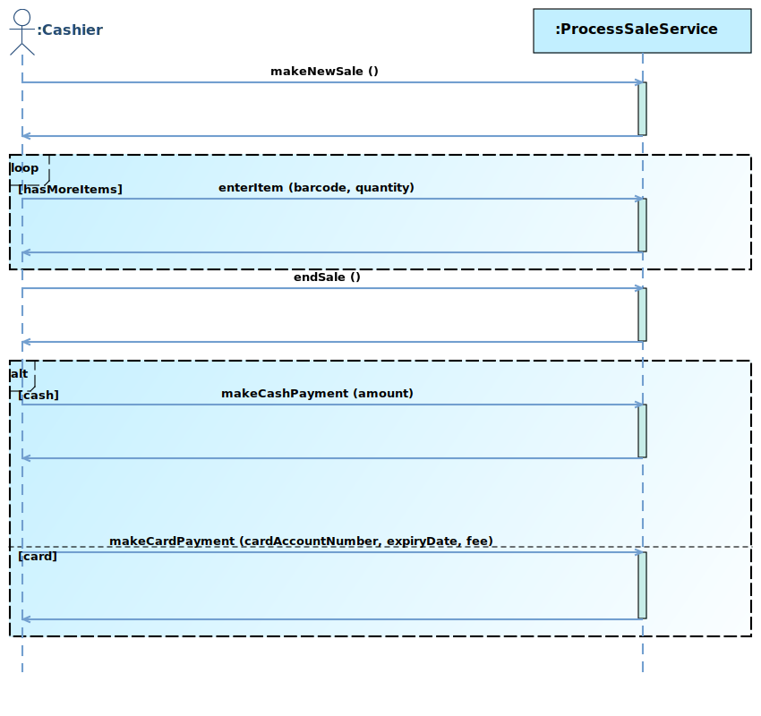

The input to ValidGen is a System Sequence Diagram, a Scenario Model represented by BPMN Model, and an optional test data package.

- **System sequence diagrams:** A system sequence diagram describes a particular domain process of a use case. It contains the actors that interact with the system, the system and the system events that the actors generate, their order, and inter-system events. 
- **Scenario Model:** The scenario model mainly consists of use cases and some relations between use cases, which tells the tool which use cases need to be executed to show a business process and in what order.
- **Test Data: **Test data is an optional input, and users can specify some unique inputs according to their needs through this interface, which makes the tool more flexible.

### 1）Generate The Prototype

* First, you need to generate the prototype using the RM2PT.

* Second, you need to use inputgen to enhance the prototype.

  

### 2）Build Scenario Model

Before using the tool to validate the requirements, you must build the scenario model by BPMN-Designer integrated with the tool. We mainly used three components in the BPMN model:

- The task represents the use case.
- Sequence Flow represents the association between use cases.
- Exclusive Gateway represents the branch node.


### 3）Importing the initial data

Some initial data is required to initialize the inputgen. We have provided a sample of COCOME, which you can download [here](https://github.com/Map1e-fans/com.rm2pt.generator.testgen.remodel).

```yaml
Store:
- Id: 1
  Name: Walmart
  Address: Main
  IsOpened: false
- Id: 2
  Name: Target
  Address: Elm
  IsOpened: false
```

### 4）Automatic generation of validation script

You can right-click the ".remodel" file, select the "Generate Validate Script" function, and a wizard window will appear. A validation script can be automatically generated after selecting the relevant attributes according to the prompts.

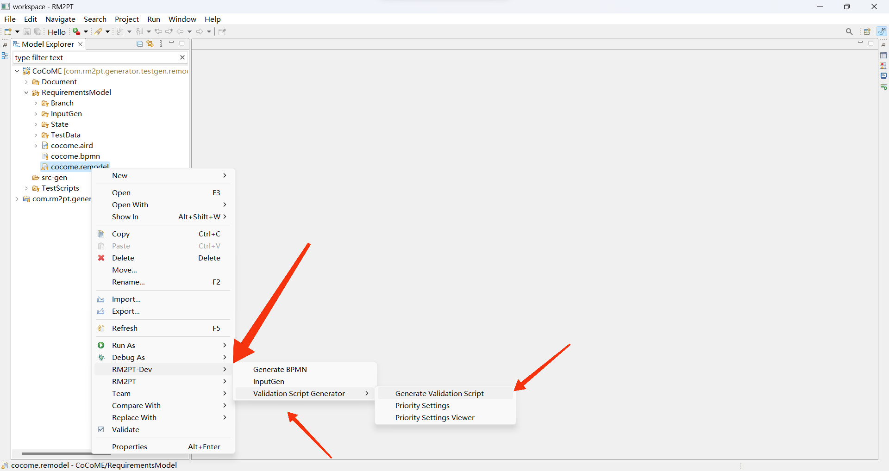


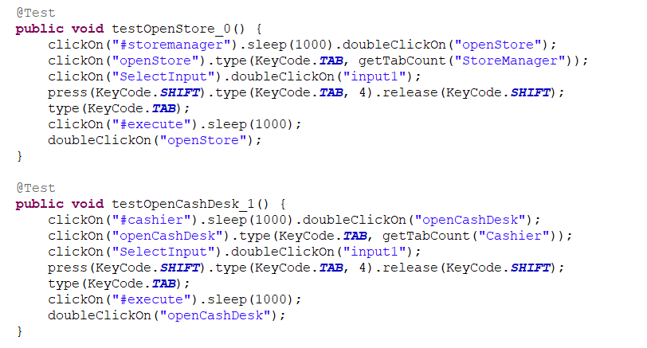

### 5）Run The Validation Script

right-click the prototype project -> run as -> Maven Test.

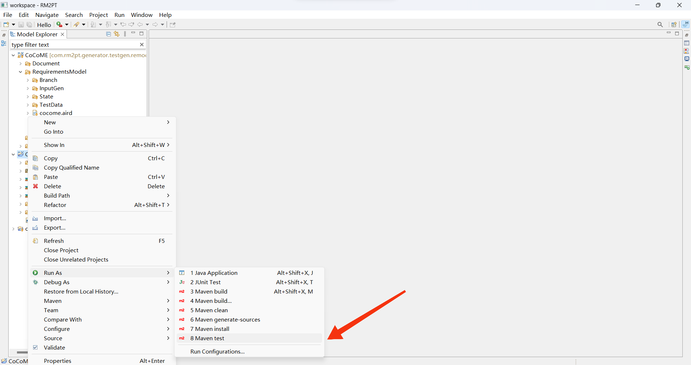

